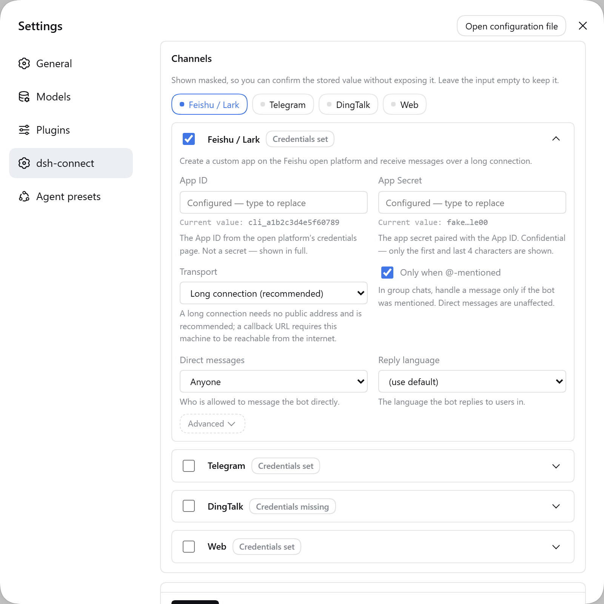
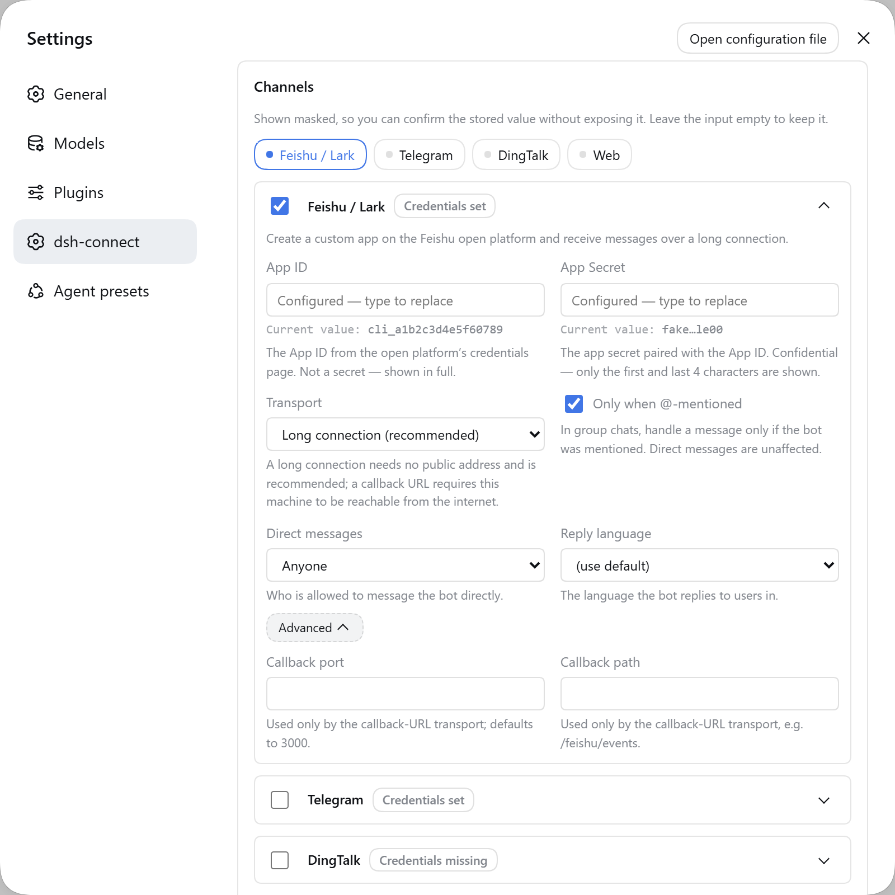
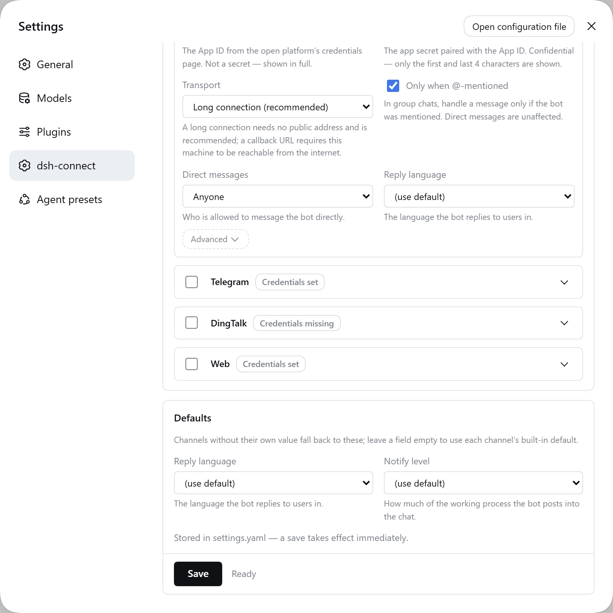

# dsh-connect

English | [中文](README.zh.md)

Connect [DeepSeek Harness](https://github.com/deepseek-ai/deepseek-harness) (**DSH**) agents to chat platforms — **Feishu / Lark**, **Telegram** and **DingTalk**, in one plugin. Send tasks from your messaging app, watch the agent execute with live streaming output, keep multi-turn context, and get result summaries pushed back when a task finishes.

## Features

- **Bidirectional messaging**: Feishu messages → DSH agent (`agent.followup`); agent replies stream back to Feishu as typewriter-style cards.
- **Multi-turn context**: each Feishu chat (DM or group) is bound to a DSH `Session`, automatically `resume`d after a process restart.
- **Work arrangement**: pushes a result-summary card when a task ends; `ctx.connect.notify()` lets goals/jobs hooks push progress proactively.
- **Task-end stats**: when a task finishes, a card reports the model used, input/output/cached tokens, step count, duration and context usage, with a `/compact` suggestion when the context is ≥ 75% full.
- **Notification levels**: `full` (stream everything) / `important` (key milestones) / `result` (answer only, the default — cards stay short) — switchable per chat via the settings menu or `/notify`, persisted across restarts.
- **Instant feedback + proactive progress**: every task is acknowledged the moment it is received (“✅ 已收到，开始处理”, with the queued-message count when busy), key milestones (thinking, tool calls with step counters, questions, permissions) react live, and a configurable watchdog sends a standalone status card when a turn has been silent for too long (default 5 min, per-chat adjustable via `/progress` or `/settings`).
- **First-time welcome**: the first message in each chat triggers a one-time welcome card introducing the bot's capabilities and common commands.
- **Actionable errors**: failed tasks show a suggestion matched to the error — permission / network / model-quota problems each get their own fix hint instead of a bare error string.
- **Safe destructive actions**: `/clear`, `/new` and the menu's “新建对话” ask for confirmation first, so history is never wiped by accident.
- **User choices & permission approvals in chat**: when the agent asks a question (`ask_user_question`) or requests a permission approval (sandbox escalation etc.), an interactive card with buttons appears right in Feishu — answer by tapping or by replying with text (number or option label); no need to open the Web GUI.
- **Security**: groups require @mention by default; user/chat allowlists; per-channel credentials via environment variables, the config file, or the DSH credential store (written from the settings pane, never echoed back in the clear).
- **Interactive menus**: `/menu` offers hierarchical point-and-click navigation (workdir / chats / settings / plugins / compact, …) — the same card updates in place, supports back/exit, and stays usable across consecutive actions.
- **Smart image & file handling**: images sent to the bot are downloaded automatically; if the main model supports vision it sees them directly, otherwise a vision-model sub-task describes them and the description is injected — so a text-only main model never stalls on images. Attached files/audio/video are also downloaded into the workdir.
- **Web mirror**: each chat can mirror its DSH session into the DSH Web GUI (`/mirror`, or automatic via `autoMirror`). The mirror lock is enforced only on the Feishu side (`lockOwner`): the Web GUI reads/writes the DSH session directly and never consults the lock, so mutual exclusion is one-sided (not fixable at the repository level — documented as-is). `/new`, `/clear` or switching sessions resets the mirror target; `autoMirror` rebuilds it for new sessions.
- **Scheduled reminders**: `/remind 10分钟 喝水` (or `2h` / `14:30`) persists a chat-level reminder that fires without waking the agent — no model tokens spent — and survives process restarts. `/schedule` lists these together with the agent's own in-session reminders.
- **Send files back to the chat**: `/send <path>` delivers a workspace file — images inline, other files as attachments (feishu / telegram).
- **Admin broadcast**: `/broadcast <text>` pushes a message to every bound chat across all channels (admins listed in `allowUsers`).
- **Thread isolation (feishu, optional)**: `threadIsolation: true` keeps each group thread in its own DSH session.
- **Local commands** (no model tokens): `/status` `/task` `/chat` `/dir` `/workspace` `/workspaces` `/plugins` `/compact` `/history` `/export` `/goals` `/schedule` `/remind` `/send` `/broadcast` `/model` `/notify` `/progress` `/mirror` `/unlock` `/renew` `/new` `/clear` `/stop` `/settings` `/help`.
- **All-in-one, multi-platform**: `dsh-connect` is the single plugin — the core `connect` service plus every channel adapter (Feishu/Lark, Telegram, DingTalk) and the web-settings stack, all behind one `channels` selector. Enable exactly the channels you use.

## Repository layout

```
packages/
  connect/           dsh-connect all-in-one plugin: core connect service + channel adapters + web-settings stack
    src/             core: agent runner, adapter registry/routing, binding store, commands
    src/channels/    per-channel adapters: feishu (Feishu long connection, normalization, streaming replies), telegram (Bot API long-polling, streaming edits), dingtalk (stream-mode bidirectional + webhook push), web (mirror monitor)
    src/settings/    web-settings stack: host RPC, credential store, secret-disclosure policy
    client/          web-settings frontend plugin, plus its dependency-free modules (locale.mjs, panel-state.mjs)
    docs/images/     settings-pane screenshots used by the READMEs
    test/            node:test suites
docs/
  QUICKSTART.md          step-by-step run guide (DSH side + platform side)
  config-reference.md    every plugin option, annotated
  feishu-setup.md        Feishu Open Platform configuration manual
  telegram-setup.md      Telegram BotFather setup manual
  dingtalk-setup.md      DingTalk group custom-robot setup manual
  PUBLISHING.md          naming + GitHub/npm discoverability guide
  all-in-one-and-web-settings.md
                         the consolidation + settings-stack design notes
  archive/               superseded per-package docs, kept for history
examples/
  profile-cordis.patch.yml
```

Every `docs/*.md` that a user needs has a `.zh.md` sibling.

## Channel matrix

| Channel | Adapter (in `dsh-connect`) | Direction | Transport | Notes |
|---|---|---|---|---|
| Feishu / Lark | `feishu` channel | bidirectional | WebSocket long connection | full features (streaming, menus, images) |
| Telegram | `telegram` channel | bidirectional | Bot API long polling | full features (streaming edits, inline keyboards) |
| DingTalk | `dingtalk` channel | bidirectional (stream) / one-way push | stream gateway (STOMP over WebSocket) / group-robot webhook | stream mode: @-mention triggers the agent, replies & numbered-text menus; webhook mode: push service (sendMarkdown / sendText / @mentions) |
| Web mirror | `web` channel | outbound no-op | monitor | tracks mirror sessions for DSH Web GUI (no synthesized messages) |

All channels share the same `dsh-connect` core: commands, `/menu`, notification levels, the proactive progress watchdog, interactive choices & approvals, and per-chat settings work identically on every channel. Enable the channels you want via the `channels` selector; per-channel secrets can live in the DSH credential store.

## The settings pane

`dsh-connect` adds its own page under **Settings → dsh-connect**. It is a channel tab strip over
collapsible cards: each card's title row is a button, low-frequency fields hide behind a second-level
**Advanced** fold, and the save row is pinned to the bottom of the scroll area.

| Channels & credentials | Advanced fold open |
|---|---|
|  |  |



中文截图：[概览](packages/connect/docs/images/settings-overview-zh.png) · [高级](packages/connect/docs/images/settings-advanced-zh.png) · [公共默认](packages/connect/docs/images/settings-defaults-zh.png).

> The shots come from a throwaway profile whose credentials are all placeholders. There is no real
> secret in frame — there cannot be: the host masks values before they reach the browser (see
> [seeing and masking stored values](#seeing-and-masking-stored-values)).

Cards default to the channels you have enabled (or the first one, if none). Clicking a tab expands
that card and scrolls it into view; it does **not** collapse the others — several open at once is a
valid state. Collapsing *unmounts* the card body rather than hiding it, which is safe because a
secret you typed but have not saved lives in the pane's own state, not in the card. Ticking a
channel's enable box also expands it.

### Where settings live

The pane edits the `dsh-connect` section of `$DSH_HOME/settings.yaml`, through DSH's first-party
settings seam — hot-reloaded, written atomically under a file lock, comments preserved. So editing
that file by hand works just as well. Values resolve in three layers, most specific last:

1. the plugin's built-in schema defaults;
2. the plugin's own `cordis.patch.yml` entry (your existing config is *not* discarded — it registers as the base layer);
3. the `dsh-connect` section of `settings.yaml`.

**Secrets never go into `settings.yaml`.** That is a plain document users are encouraged to paste into
issues; credentials live in the DSH credential store (`ctx.credentials`), which is also where
one-click onboarding and `FEISHU_*`-style environment variables write.

The legacy `/dsh-connect` HTTP RPC is kept for pane compatibility; it reads and writes the same
namespace and mirrors non-secret config to `settingsStatePath` for older panes.

### Seeing and masking stored values

Every saved secret field has a **read-only** "current value" line under it (or "not set"), so you can
confirm what you configured without re-typing it. Masking happens **host-side**, from a single shared
policy table (`src/settings/secret-disclosure.ts`) that the host masks by and the pane renders input
`type`s from — so the two cannot disagree.

| Field | How it is shown |
|---|---|
| `appId`, `clientId` | **In full.** These are identifiers, not passphrases: they go out with every API call and are visible in the vendor console. Hiding them protects nothing. |
| `appSecret`, `clientSecret`, `botToken`, `secret` | Head and tail only, e.g. `a1b2…z9y8`. Values too short for that to mean anything degrade to a fixed-length `••••••`. |
| `webhookUrl` (DingTalk) | **URL-aware.** Scheme, host, path and parameter *names* stay; only the token in the middle is masked — DingTalk puts it in the query string, and masking the whole URL (`https…bcde`) would let you confirm nothing. |
| anything else | Masked the most conservative way. |

Two properties hold regardless:

- **A usable secret never crosses the wire.** Values are masked before they leave the host, so a browser tab — and a screenshot of it — never holds a working credential.
- **A mask can never be written back.** Previews are text *beside* the input, not its `value`. Inputs stay empty, and empty means "leave the stored value alone", so saving config alone writes no credentials.

The pane's own strings all come from `client/locale.mjs`, which ships both `zh` and `en`; a test
asserts the two key sets are identical, because the host resolves a missing key by silently falling
back to the other language.

### Credential groups

A channel counts as **configured** when *any one* of its credential groups is fully satisfied —
all-of within a group, any-of across groups. A channel with no groups (`web`) is satisfied by
definition and never shows a warning badge.

Groups exist because a channel can have more than one mutually exclusive way to authenticate, and
demanding all of them would report working bots as unconfigured:

| Channel | Groups |
|---|---|
| `feishu` | app id + app secret |
| `telegram` | bot token |
| `dingtalk` | webhook URL + signing secret — *or* — stream-mode client id + client secret |
| `web` | none |

So a DingTalk bot pushing via webhook only (no stream credentials) is correctly reported as
configured, and so is a stream-only one.

## Quick start

### Install

The package is published to npm automatically on every GitHub Release — [`.github/workflows/publish.yml`](.github/workflows/publish.yml) runs `pnpm build` + typecheck first, then publishes `dsh-connect`. **Install it once** — one plugin, one config block, and enable only the channels you use:

```sh
dsh plugin --profile web add dsh-connect
```

(Installing the single package pulls in the core `connect` service, every channel adapter, and the web-settings stack. Enable the channels you need via the `channels` selector.)

For local development (before the package is published), load the built package by absolute path as shown in [docs/QUICKSTART.md](docs/QUICKSTART.md).

### Configure

Append to the profile's `cordis.patch.yml` (`$DSH_HOME/profiles/web/cordis.patch.yml`). The plugin registers itself automatically via its bundle manifest, so this file only overrides its config — do **not** `insert` it again (a duplicate `id` makes dsh refuse to boot with `duplicate loader entry id`):

```yaml
- id: connect
  name: dsh-connect
  config:
    channels: [feishu, telegram, dingtalk]   # which channels to enable (default: all built-in)
    channelDefaults:
      language: zh                            # common keys inherited by every channel
    feishu:
      appId: cli_xxxx
      appSecret: cli_secret_xxxx
      transport: websocket
      requireMention: true
      dmMode: open
    telegram:
      botToken: "123456:ABC-YourBotToken"     # from @BotFather
      requireMention: true
    dingtalk:
      webhookUrl: "https://oapi.dingtalk.com/robot/send?access_token=xxx"
      # stream: { clientId: xxx, clientSecret: xxx }   # enable bidirectional stream mode
```

> Credentials (`appSecret`/`botToken`/`clientSecret`) can instead live in the DSH credential store and be written from the Web settings pane — see [docs/config-reference.md](docs/config-reference.md).

### Run

Restart `dsh web` (Host plugins require a process restart to load), complete the platform-side subscription per [docs/feishu-setup.md](docs/feishu-setup.md), [docs/telegram-setup.md](docs/telegram-setup.md) or [docs/dingtalk-setup.md](docs/dingtalk-setup.md), then chat with the bot.

> Detailed step-by-step instructions (including Feishu-side setup and verification) are in [docs/QUICKSTART.md](docs/QUICKSTART.md).

## Command list

| Command | Description |
|---|---|
| `/menu` | Open the main menu (hierarchical point-and-click; the same card updates in place; back / exit supported) |
| `/settings` (`/set`) | Settings: switch model / reasoning effort / notification level / config overview |
| `/model` | Show the current model, tap to switch |
| `/notify` (`/notice`) | Choose the notification level: `full` / `important` / `result` (takes effect immediately) |
| `/progress` | Choose how long a silent task may run before a proactive progress card is sent (default 5 min; `关闭` disables) |
| `/mirror [--timeout N]` | Create (or show) the Web mirror session for this chat; optional lock timeout in minutes |
| `/unlock` | Manually release the session lock (Feishu/Web mirror scenario only) |
| `/renew` (`/renew-lock`) | Renew the current session lock timeout |
| `/status` | Session status, model, workdir, queue length, **context tokens**, session ID |
| `/task` (`/tasks` `/todo`) | Show the current task list |
| `/schedule` (`/reminders`) | Show scheduled reminders for this session |
| `/chat` (`/session` `/sessions`) | List chats; tap to switch or create a new one |
| `/dir` (`/cd` `/pwd`) | Switch workdir (tap to pick, or `/dir <absolute path>`) |
| `/workspace <absolute path>` | Create a new workspace |
| `/workspaces` | List all workspaces |
| `/plugins` | List installed plugins |
| `/compact` | Compact the current session context |
| `/history [count]` | Show recent session messages |
| `/export [markdown]` | Export conversation history as Markdown |
| `/goals` | Show current goals |
| `/new` (`/reset`) | Start a new conversation (asks for confirmation) |
| `/clear` | Clear the current conversation (asks for confirmation) |
| `/stop` (`/cancel`) | Stop the current task |
| `/help` | List all commands |

> All `/` commands are executed locally by the plugin and consume no model tokens; any other text is sent to the DSH agent as a task.

## Configuration

### dsh-connect (core)

| Key | Default | Description |
|---|---|---|
| `agentPreset` | unset = roster default | Agent preset used for each bound session (e.g. `standard`). Resolution degrades rather than throwing: the configured id is tried, then `standard` (or the roster's first mountable row), and if neither composes the agent is built without a preset so the turn still runs. A stale id is logged, not fatal. |
| `workDir` | first DSH workspace | Agent working directory (absolute path, can be set explicitly) |
| `workspaces` | `[]` | Workdirs listed in the `/dir` interactive picker |
| `visionModel` | auto-detected | Vision model `{provider, model}` for the image sub-task; when unset, the first image-capable model is auto-detected |
| `language` | `zh` | User-facing message language: `zh` (default) or `en` |
| `allowUsers` | `[]` | Sender allowlist (empty = allow all) |
| `allowChats` | `[]` | Chat allowlist (empty = allow all) |
| `stateDir` | `./.dsh-connect` | Directory for the binding route `bindings.json` |
| `autoMirror` | `true` | Automatically create a Web mirror session for every new chat |
| `streamHeartbeatMs` | `60000` | Streaming-card liveness heartbeat (ms); `0` disables it |
| `notifyLevel` | `result` | Default notification level: `full` (stream everything) / `important` (key milestones) / `result` (answer only, the default); per-chat override via `/settings` or `/notify` |
| `progressTimeoutMs` | `300000` | Proactive progress-notice interval (ms): when a turn has sent nothing for this long, a standalone status card is pushed; `0` disables; per-chat override via `/settings` or `/progress` |

### Feishu channel (`feishu`)

| Key | Default | Description |
|---|---|---|
| `appId` / `appSecret` | env `FEISHU_APP_ID` / `FEISHU_APP_SECRET`, or **one-click onboarding** | App credentials (when unset, onboarding mode starts and creates the app via QR scan) |
| `transport` | `websocket` | `websocket` (default, long connection); `webhook` needs a public HTTPS callback URL — the adapter hosts its own HTTP service and auto-answers the `url_verification` challenge |
| `webhookPort` | `9000` | HTTP listen port for webhook transport mode |
| `webhookPath` | `/` | Feishu event callback path |
| `verificationToken` / `encryptKey` | empty | Only needed for webhook mode |
| `requireMention` | `true` | Groups only respond when the bot is @mentioned |
| `dmMode` | `open` | DM policy: `open` / `allowlist` / `pair` / `disabled` (`disabled` = ignore DMs) |
| `language` | `zh` | User-facing message language: `zh` (default) or `en` |

> **One-click onboarding**: start the plugin without `appId`/`appSecret` and it prints an onboarding link (valid ~10 minutes). Scan it with Feishu (or click and confirm) and the bot app is created automatically with permissions and event subscriptions preset; credentials are saved to the DSH credential store. (Before 0.9.0 they went to `$DSH_HOME/.dsh-connect/feishu-credentials.json`, which nothing read back — an existing install is backfilled from that file once on boot, then it is unused.) The flow only starts when it can actually be completed: it is skipped when `onboarding: false` or stdout is not a terminal, so a headless service process cannot begin a QR scan nobody can answer.

## How it works

- **Agent create/resume**: reuses the standard DSH driving pattern (see `dsh-headless`) — `ctx.agents.create({ meta:{cwd, agentPreset}, agentOptions:{provider,model}, setup })`; resume goes through `ctx.agents.resume`. Model selection per session is owned by the DSH api-proxy (`selectionFor`), so switching models in the Web GUI applies to the bound sessions.
- **Preset mounting**: `setup` mounts the configured agent preset (`ctx.agentPresets.mount`), giving bound sessions the standard toolset (bash/fs/…). The mount is best-effort — the configured id, then `standard` (or the roster's first mountable row), then no preset at all — because preset resolution happens *before* an agent exists, so a throw there would kill every turn of every bound chat with a raw host error instead of a reply.
- **Streaming**: two feeds are bridged via `createAsyncQueue` into the channel's streaming card. The durable `session/event` stream carries turns, tool calls and settlement; the transient `agent/assistant-stream` frames carry the reasoning/text deltas. They are separate subscriptions because DSH `0.1.5-rc.2` deleted the `assistant/chunk` session event that used to carry both. Blocks are separated by blank lines, reasoning is streamed live, tool calls show a status line, and a configurable heartbeat keeps the card alive during long silent phases. `turn/end` decides the turn outcome and posts the task-stats card.
- **Proactive progress**: each message is acknowledged immediately; if no standalone card/text has been sent for `progressTimeoutMs`, a status card reports the latest milestone (thinking / last tool call) so a long turn never looks frozen.
- **Interactive choices & approvals**: the plugin listens on the host's own question and approval waterfalls (`user-questions/request`, `approval/request`) and answers them from the chat. It must register with `{ prepend: true }`: the host's Web-GUI forwarder is *also* a listener on these events and parks the waterfall on a promise that never settles while no browser tab is connected, so a listener registered after it is never called at all. A request whose session is bound to a connect chat is rendered as a card — one button per option, or `allow once` / `reject` for an approval — and the tapped answer is returned as the waterfall's result; that session is then the chat's, and the Web GUI is unaffected for every other one. A request the bridge does not claim (an unowned session, a channel with no inbound face, one already cancelled, or a card that could not be delivered) calls `next()` and reaches the host's normal path, which also keeps the Web GUI fully functional.
- **Serialization**: one `AgentRunner` per chatKey — messages are queued and executed serially; `agent.followup` naturally queues.

## Testing

All suites are `node:test`, run through the consolidated runner (build `lib/` first):

```sh
pnpm build        # build first (generates lib/)
pnpm test         # runs every suite via packages/connect/test/run-all.mjs
```

- `packages/connect/test/run-all.mjs`: imports every suite in-process (see each suite below).
- `packages/connect/test/unit.test.mjs` + `packages/connect/test/smoke.mjs` (connect core suite): command parsing, binding persistence, async queue, turn outcome derivation; plus loading the plugins into a real Cordis context to verify the plugin contract, including the `isChatAllowed` allowlist pre-filter assertion.
- `packages/connect/test/feishu.test.mjs`: button grid, label alignment, filename sanitization, error extraction.
- `packages/connect/test/telegram.test.mjs`: HTML escaping, @mention detection, offset confirmation semantics.
- `packages/connect/test/dingtalk.test.mjs`: signature verification, retry/rate-limit, 20000-character truncation.
- `packages/connect/test/web.test.mjs`: mirror records, no-synthesized-message regression test.
- `packages/connect/test/settings-*.test.mjs`, `rpc-client.test.mjs`, `credential-store.test.mjs`, `apply.test.mjs`, `web-settings-*.test.mjs`, `channels.test.mjs`, `channel-runtime.test.mjs`, `settings-namespace.test.mjs`: the all-in-one config + web-settings stack (channel activation, host RPC, settings persistence, credential store, namespace registration, round-trip).
- `packages/connect/test/runner.test.mjs` + `agent-scope.test.mjs`: the bridge's core turn path — session-log and streaming-event handling, and agent-preset resolution including its degraded paths (a stale id recovers; a healthy resolution still mounts exactly the configured preset and logs nothing).
- Three guards on the settings pane itself, added in 0.9.0:
  - `secret-disclosure.test.mjs` pins the masking policy (full vs head/tail vs URL-aware, short values, unknown keys).
  - `locale.test.mjs` asserts `zh` and `en` cover *exactly* the same key set — the host resolves a missing key by silently falling back to `en`, which is how a Chinese page ends up half-English with no error anywhere.
  - `client-bundle.test.mjs` loads the **built** `client/client.js` through a stub `window.__ModuleLoader__`, renders the pane in Node, and asserts the rendered input `type`s agree with the shared disclosure table, that every field's label and hint reach the DOM, and that no mask — or stored secret — is ever placed in an input. It also fails if the bundle was not rebuilt after editing its source. The card fold is pinned separately in `panel-state.test.mjs`, as a pure module.
- `packages/connect/test/e2e-bridge.mjs`: inbound message → agent turn → outbound reply, asserted offline against a scripted agent *and* against a live `dsh` host. The live leg self-gates and prints `E2E SKIP` when no launcher is present, so it can never pass by doing nothing.

## Documentation

- [Feishu Open Platform configuration](docs/feishu-setup.md) ([中文](docs/feishu-setup.zh.md))
- [Telegram setup](docs/telegram-setup.md) ([中文](docs/telegram-setup.zh.md)) · [DingTalk setup](docs/dingtalk-setup.md) ([中文](docs/dingtalk-setup.zh.md))
- [Step-by-step run guide](docs/QUICKSTART.md) ([中文](docs/QUICKSTART.zh.md))
- [Full option reference](docs/config-reference.md)
- [Naming and GitHub/npm discoverability](docs/PUBLISHING.md) ([中文](docs/PUBLISHING.zh.md))
- [Example configuration](examples/profile-cordis.patch.yml)

## License

MIT
