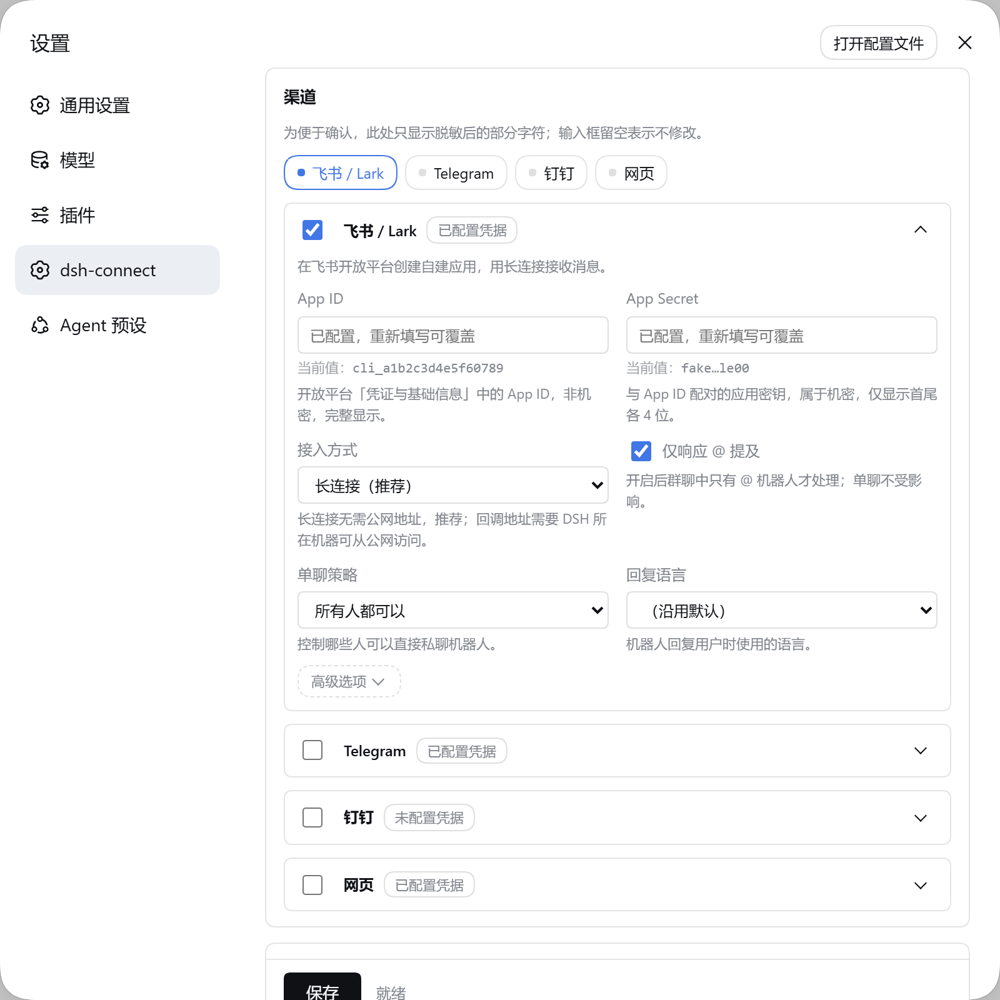
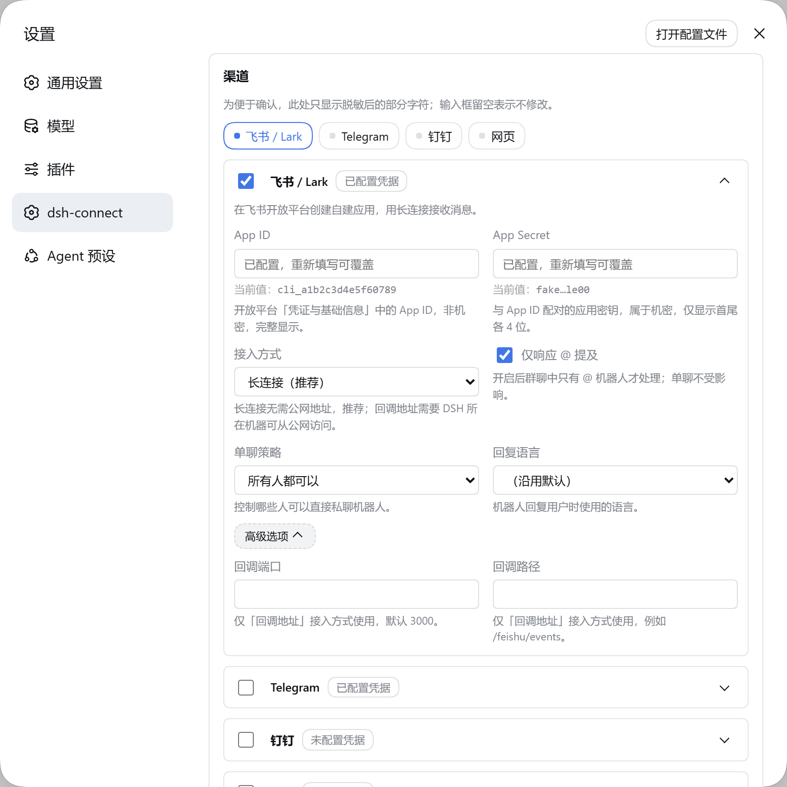
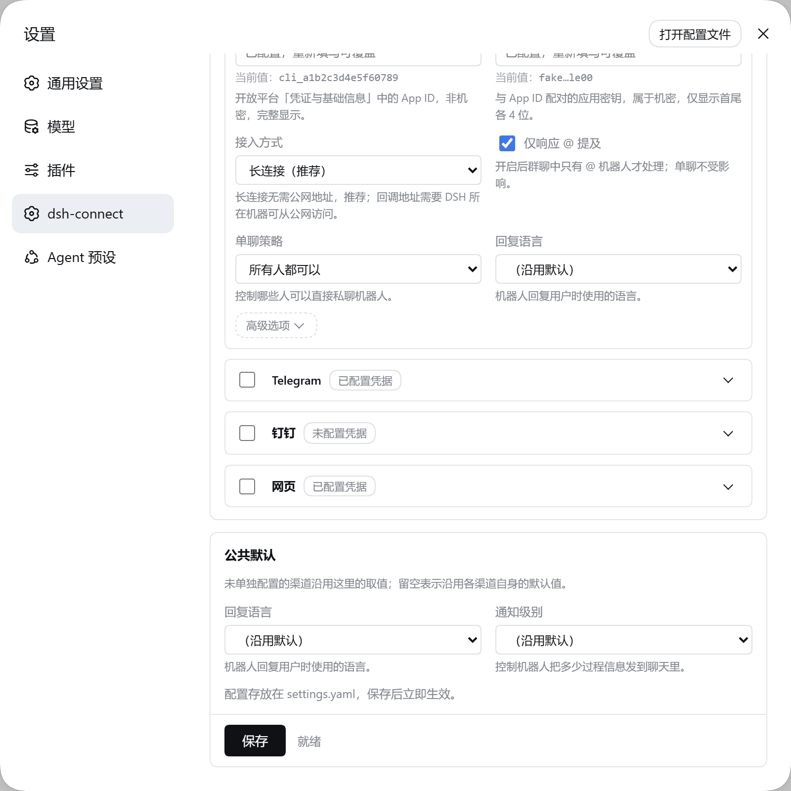

# dsh-connect

English | [中文](README.zh.md)

The **all-in-one plugin** for connecting [DeepSeek Harness](https://github.com/deepseek-ai/deepseek-harness) (**DSH**) agents to chat platforms (Feishu / Lark, Telegram, DingTalk, and the Web mirror; more to come): session binding, agent driving, streaming reply bridging, interactive menu cards, local commands, and the web-settings stack.

> One install, one config block: the core `connect` service, every channel adapter (feishu / telegram / dingtalk / web), and the web-settings stack all live in this single package. Enable the channels you use via the `channels` selector. The former split packages (`dsh-connect-feishu`, `dsh-connect-telegram`, `dsh-connect-dingtalk`, `dsh-connect-web`) and the `dsh-connect-all` bundle no longer exist.

## Overview

`dsh-connect` binds a chat conversation to a DSH agent session and drives it end to end:

- **Session binding & routing** — one chat ⇄ one agent session, persisted in a `bindings.json` route store; sessions can be created, resumed, switched, cleared and mirrored to the DSH Web GUI.
- **Streaming replies** — the model's live deltas are bridged into the channel's native streaming (Feishu typewriter cards): the thinking hint opens the reasoning phase, reasoning streams live with readable paragraph breaks, tool calls appear as `🔧` progress lines, and a liveness heartbeat keeps the card moving even through long silent stretches (long first-token waits, heavy tool runs) so it never sits frozen on "Thinking…". The runner keeps two subscriptions, because `0.1.5-rc.2` split what used to be one: the durable `session/event` stream carries turns, tools and settlement, while the transient `agent/assistant-stream` frames carry the deltas — the `assistant/chunk` session event that used to carry both is gone.
- **Notification levels** — per-chat control over how much of the process is streamed: `尽量输出过程` (full process) / `输出重要节点` (key milestones) / `只输出结果` (result only). Switch any time via the settings menu or `/notify`; the choice is persisted per chat and applies immediately.
- **Task-end stats** — after every task a compact card reports the model used, input/output tokens, elapsed time and context-window usage, and suggests `/compact` when the context is getting full.
- **Interactive menus** — button cards for status, tasks, history, goals, schedule, model/effort switching, workspace picking, language, and more (see the in-chat `/` commands).
- **Media handling** — downloads user images/attachments, passes them to a vision-capable model (or a configured vision model) so text-only main models never stall on images.
- **Locking & queuing** — per-chat write locks coordinate Feishu and Web writers; queued messages drain when the lock releases.
- **Web mirror (auto)** — every Feishu conversation is automatically available in the DSH Web GUI as a mirrored session (disable with `autoMirror: false`).

**Who is it for?** Anyone running DSH who wants to operate agents from a chat platform — solo operators running a bot for their own workspaces, and small teams sharing a bot in group chats with an allowlist.

## Compatibility

| Aspect | Value |
|---|---|
| DSH version | `^0.1.5-rc.2` (peer `@deepseek-ai/dsh-agent`, `dsh-llm`, `dsh-session`) |
| Cordis | `^4.0.1` |
| Node.js | ≥ 20 (ESM, `NodeNext`) |
| Last verified | **2026-09-21** against DSH `0.1.5-rc.2` on Windows (host load, Feishu WebSocket transport, web-settings pane) |

**Keep the peer range in step with the host.** Upstream ships no changelog or
migration guide, so a stale range is the only thing standing between this plugin
and silent breakage: DSH `0.1.5-rc.2` deleted the `Session.events` accessor and
the `assistant/chunk` event type outright, and every `dsh-*` package is versioned
on the same line. When you upgrade DSH, bump `peerDependencies` (and
`devDependencies`) for `dsh-agent`, `dsh-llm` and `dsh-session` together, re-run
`tsc`, and re-run the test suite — a range that no longer overlaps the host
version is the signal that the bridge needs another migration.

The plugin runs on the DSH **Host plane** (process-level singleton services), not inside an agent preset.

## Install / Uninstall

Plugin management is a thin wrapper over pnpm in the DSH profile:

```sh
# Install the single all-in-one plugin (core + all channel adapters + web-settings)
dsh plugin --profile web add dsh-connect
```

**Upgrade**

```sh
dsh plugin --profile web update dsh-connect
```

**Disable** — override the bundle-registered entry with `disabled: true` in the profile patch (see `~/.dsh/profiles/<profile>/cordis.patch.yml`):

```yaml
- id: connect
  name: dsh-connect
  disabled: true
```

**Complete removal** — uninstall the package and delete the data it created:

```sh
dsh plugin --profile web remove dsh-connect
# then remove the plugin data (see "Permissions & data" below):
rm -rf .dsh-connect            # binding route store (stateDir)
rm -f ~/.dsh/.dsh-connect/feishu-credentials.json
```

## Quick start

1. **Install the plugins** (see above).
2. **Add the minimal config** to `~/.dsh/profiles/<profile>/cordis.patch.yml` — the shape is also in [`examples/minimal.config.json`](examples/minimal.config.json), and the fully commented version is [`examples/profile-cordis.patch.yml`](https://github.com/IvanWu2015/dsh-connect/blob/main/examples/profile-cordis.patch.yml) in the repository (that path is outside the published tarball, hence the absolute link). The plugin registers itself via its bundle manifest, so only override its config — do **not** `insert` it again (a duplicate id crashes dsh at boot):

   ```yaml
   - id: connect
     name: dsh-connect
     # workDir: D:\your\workdir     # agent working directory (default: process cwd)
     config:
       channels: [feishu]            # which channels to activate; omit = all built-in
       # channelDefaults: { language: zh }   # keys applied to every channel that doesn't set its own
       feishu:
         appId: cli_xxxx
         appSecret: cli_secret_xxxx
         transport: websocket
         requireMention: true
         dmMode: open
   ```

3. **Start the host** — `dsh web` (or `dsh run`). With no credentials configured, the `feishu` channel enters **one-click onboarding**: scan the QR / open the link from the log to authorize the bot.
4. **Send a message** to the bot in Feishu. The bot replies with a streaming card; `/help` lists all commands; the conversation also appears in the DSH Web GUI automatically (auto-mirror).

A fully reproducible example is the [`examples/`](examples/) folder plus the repository's [Feishu setup manual](https://github.com/IvanWu2015/dsh-connect/blob/main/docs/feishu-setup.md) (Feishu app creation, event subscriptions, publishing).

## Configuration

Configuration lives in the DSH profile patch (`cordis.patch.yml`) under the plugin's `config:`. `dsh.shared.config.json` in the project root (or its parent) can supply workspace/state defaults that take precedence for those keys.

### `dsh-connect` (core)

| Key | Default | Description |
|---|---|---|
| `agentPreset` | roster default | Agent preset id composed into each bound session. Resolution is best-effort: the configured id is tried, then `standard` (or the roster's first mountable row), and if neither composes the agent is built without a preset so the turn still runs. A stale id therefore degrades instead of failing every message — it is logged, not thrown. |
| `workDir` | process cwd | Absolute working directory for each bound agent |
| `workspaces` | `[]` | Extra workspaces offered by the `/dir` picker |
| `visionModel` | auto-detected | `{ provider, model }` used to describe images when the main model can't see them |
| `language` | `zh` | User-facing message language: `zh` / `en` |
| `allowUsers` | `[]` | Sender allowlist (open_id). Empty = allow all |
| `allowChats` | `[]` | Chat allowlist (chat_id). Empty = allow all |
| `stateDir` | `.dsh-connect` | Directory holding the `bindings.json` route store (env `DSH_CONNECT_STATE_DIR` overrides) |
| `autoMirror` | `true` | Automatically create a Web GUI mirror for every new session |
| `streamHeartbeatMs` | `60000` | Liveness heartbeat interval (ms) for the streaming card; `0` disables it |
| `notifyLevel` | `result` | Default notification level: `full` (stream everything) / `important` (key milestones) / `result` (answer only, the default); per-chat override via settings menu or `/notify` |
| `progressTimeoutMs` | `300000` | Proactive progress-notice interval (ms): when a turn has sent no standalone card/text for this long, a status card reports the latest milestone; `0` disables; per-chat override via settings menu or `/progress` |

### Shared (all channels)

| Key | Default | Description |
|---|---|---|
| `channels` | all built-in | Which channels to activate: `feishu` / `telegram` / `dingtalk` / `web`. Omit to activate all built-in channels. |
| `channelDefaults` | `{}` | Keys applied to every channel that doesn't set its own (e.g. `{ language: "zh" }`). |
| `settingsStatePath` | `<stateDir>/dsh-connect-settings.json` | Where the web-settings pane mirrors non-secret config. Defaults to `dsh-connect-settings.json` *inside* `stateDir`, so it lands beside `bindings.json` and can never disagree with the stores; set it to override. Since 0.9.0 the pane's authoritative store is the `dsh-connect` section of `$DSH_HOME/settings.yaml` (see [User settings](#user-settings)), and this file is only the compatibility mirror the legacy `/dsh-connect` RPC reads and writes. |

### `feishu` (Feishu / Lark channel)

| Key | Default | Description |
|---|---|---|
| `appId` | env `FEISHU_APP_ID` | Feishu custom app id (**secret**) |
| `appSecret` | env `FEISHU_APP_SECRET` | Feishu custom app secret (**secret**) |
| `transport` | `websocket` | `websocket` = long connection (no public network); `webhook` needs public HTTPS |
| `verificationToken` | — | Webhook verification token (**secret**) |
| `encryptKey` | — | Webhook encrypt key (**secret**) |
| `webhookPort` | `9000` | HTTP port for the built-in webhook server when `transport: "webhook"` |
| `webhookPath` | `/` | URL path the Feishu event callback posts to (webhook transport) |
| `requireMention` | `true` | Groups only respond when the bot is @mentioned |
| `dmMode` | `open` | DM policy: `open` / `allowlist` / `pair` / `disabled` |
| `language` | `zh` | User-facing message language: `zh` / `en` |

**Environment variables**

| Variable | Purpose |
|---|---|
| `FEISHU_APP_ID` / `FEISHU_APP_SECRET` | Feishu credentials — preferred over putting secrets in config files |
| `DSH_CONNECT_STATE_DIR` | Overrides `stateDir` for the binding store |
| `DSH_HOME` | Overrides the `~/.dsh` base for credential files |

**Sensitive items** — `appSecret`, `verificationToken`, `encryptKey`, and `feishu-credentials.json`. Prefer environment variables or one-click onboarding; keep them out of version control.

### `telegram` (Telegram channel)

| Key | Default | Description |
|---|---|---|
| `botToken` | env `TELEGRAM_BOT_TOKEN` | Telegram bot token from @BotFather (**secret**) |
| `requireMention` | `true` | Groups only respond when the bot is @mentioned (or replying to the bot's own message) |
| `pollingTimeoutSeconds` | `50` | `getUpdates` long-poll timeout in seconds |
| `baseUrl` | — | Optional Bot API base URL override (e.g. a local Bot API server) |
| `language` | `zh` | User-facing message language: `zh` / `en` |

### `dingtalk` (DingTalk channel)

| Key | Default | Description |
|---|---|---|
| `webhookUrl` | env `DINGTALK_WEBHOOK_URL` | Group custom-robot webhook URL (proactive push) |
| `secret` | env `DINGTALK_WEBHOOK_SECRET` | Signing secret (`SEC…`) only when signing is enabled |
| `stream.clientId` / `stream.clientSecret` | env `DINGTALK_STREAM_CLIENT_ID` / `DINGTALK_STREAM_CLIENT_SECRET` | Bidirectional stream-mode app credentials (**secret**, nested under `stream`) |
| `stream.requireMention` | `true` | Group replies need an @-mention (stream mode) |
| `defaultAt` | — | Default @-mentions merged into every push (`{ mobiles, userIds, all }`) |
| `language` | `zh` | User-facing message language: `zh` / `en` |

### `web` (Web mirror channel)

| Key | Default | Description |
|---|---|---|
| `pollIntervalMs` | `1000` | Mirror-session polling interval (ms) |

Environment variables (`FEISHU_*`, `TELEGRAM_*`, `DINGTALK_*`, `DSH_CONNECT_STATE_DIR`, `DSH_HOME`) and the DSH credential store are the preferred way to supply per-channel secrets — the web settings pane writes them to the credential store and `injectSecrets` populates them on load.

## Permissions & data

- **Files written**
  - `<stateDir>/bindings.json` (default `.dsh-connect/`) — the chat ⇄ session route store (chat keys, session ids, mirror and lock state).
  - `<stateDir>/dsh-connect-settings.json` (default `.dsh-connect/`) — the non-secret compatibility mirror, see `settingsStatePath`.
  - the `dsh-connect` section of `$DSH_HOME/settings.yaml` — written through DSH's first-party settings seam (atomic, file-locked, comment-preserving).
  - `~/.dsh/.dsh-connect/feishu-credentials.json` — **legacy**, read-only. One-click onboarding used to save Feishu credentials here instead of the credential store, so a user who had just scanned the QR code still saw `未配置凭据` forever. Onboarding now writes to the credential store, and an existing install is backfilled from this file once on boot; after that it is never read or written again.
  - `<workDir>/.dsh-connect-images/` — user images/attachments staged for the agent's tools.
  - DSH's own session logs and settings under `~/.dsh/` (sessions, settings, etc.).
- **Network**
  - Feishu Open Platform: WebSocket long connection (or webhook over public HTTPS), plus HTTPS API calls (media download, cards).
  - LLM provider APIs used by DSH for the agent's model (e.g. DeepSeek), plus the optional vision model.
- **User data** — message text and attachments flow through the bot to the agent session; they are stored in the DSH session log like any DSH conversation. The allowlists (`allowUsers` / `allowChats`) limit who can drive the bot.

## The settings pane

`dsh-connect` adds its own page under **Settings → dsh-connect**. It is a channel
tab strip over collapsible cards: each card is headed by a button, its
low-frequency fields sit behind a second-level **Advanced** fold, and
Save/status stay pinned to the bottom of the scroll region.

| Channels & credentials | Advanced fields opened |
|---|---|
|  |  |



English captures: [overview](docs/images/settings-overview-en.png) · [advanced](docs/images/settings-advanced-en.png) · [defaults](docs/images/settings-defaults-en.png).

> Captured from a throwaway profile whose credentials are all placeholders. Nothing
> above contains a real secret — and it could not, because the host masks every
> stored value before it reaches the browser (see [below](#seeing-and-masking-stored-values)).

Cards default to the channels you have enabled (the first one, if none are), and
clicking a tab opens that card and scrolls it into view *without* closing the
others — several open at once is a legitimate state. Collapsing a card unmounts
its body rather than hiding it, which is safe because an unsaved secret you typed
lives in the pane's own state, not in the card. Ticking a channel's enable box
opens it too.

## User settings

The web settings pane (`dsh-connect` under **Settings**) edits the `dsh-connect`
section of `$DSH_HOME/settings.yaml`, through DSH's own first-party settings
seam. That document is hot-reloaded, written atomically under a file lock, and
keeps your comments — so editing it by hand works too, and a change takes
effect without a restart.

Values resolve in three layers, most specific last:

1. the schema defaults shipped with the plugin;
2. the plugin's own `cordis.patch.yml` entry (your existing config is *not*
   discarded — it is the registered base layer);
3. the `dsh-connect` section in `settings.yaml`.

**Secrets are never written to `settings.yaml`.** It is a plain document users
are invited to paste into bug reports, so credentials stay in the DSH
credential store (`ctx.credentials`) — which is also where one-click onboarding
and the `FEISHU_*`-style environment variables put them.

The legacy `/dsh-connect` HTTP RPC is retained for panel compatibility; it now
reads and writes the same namespace, and mirrors non-secret config to
`settingsStatePath` (see [Shared](#shared-all-channels)) for older panels.

### Seeing and masking stored values

The pane shows each stored credential as a read-only *current value* line under
its input (`not configured` when nothing is stored), so you can confirm what you
configured without retyping it. **The masking happens on the host**, in one shared table
(`src/settings/secret-disclosure.ts`) that both the host and the pane read — the
pane only decides whether to render the input as a `password` or a `text` field,
so the display and the policy cannot drift apart.

| Field | How it is shown |
|---|---|
| `appId`, `clientId` | **In full.** These are identifiers, not authenticators: they appear in every outbound API call and in the vendor console, so hiding them protects nothing. |
| `appSecret`, `clientSecret`, `botToken`, `secret` | Head and tail only — `a1b2…z9y8`. Values too short to survive partial disclosure show a fixed `••••••` instead. |
| `webhookUrl` (DingTalk) | URL-aware. Origin, path and parameter *names* are kept and only the token's middle is masked, because DingTalk puts the token in the query string — masking the whole URL (`https…bcde`) would confirm nothing. |
| any other key | Masked by default. |

Two properties hold regardless:

- **No usable secret crosses the wire.** The value is masked before it leaves the
  host, so a browser tab — or a screenshot of one — never holds one.
- **A mask can never be written back.** The preview is text *beside* the input,
  never the input's value. Inputs always start blank; blank means "leave the
  stored value alone", so saving the config alone writes no credential at all.

The pane's own strings (channel names, field labels, option text, status) all
come from `client/locale.mjs`, which ships `zh` and `en`. A test asserts both
languages cover exactly the same key set — the host resolves a missing key by
silently falling back to the other language, so an untranslated string shows up
as mixed-language text rather than as an error.

### Credential groups

A channel counts as *configured* when **any one** of its credential groups is
fully satisfied, and each group is satisfied only when **all** of its refs are
set — all-of within a group, any-of across groups. A channel with no groups
(`web`) is configured by definition and never shows a warning badge.

The grouping exists because a channel can have more than one mutually exclusive
way to authenticate, and requiring all of them would wrongly report a working
bot as unconfigured:

| Channel | Groups |
|---|---|
| `feishu` | app id + app secret |
| `telegram` | bot token |
| `dingtalk` | webhook URL + sign secret — *or* — stream client id + client secret |
| `web` | none |

So a DingTalk bot using only webhook push (no stream credentials) is correctly
reported as configured, as is one using only stream mode.

## Troubleshooting

Logs come from the DSH host logger (run `dsh web` in a terminal); plugin messages are prefixed `connect:` / `connect-feishu:`.

| Symptom | Likely cause / fix |
|---|---|
| `connect-feishu: adapter init failed` / `start failed` | Bad credentials, app not published, or network blocked. Check `appId`/`appSecret`, re-run onboarding, verify the bot is online in the Feishu console. |
| `connect: resume of <id> failed, creating fresh session` | The persisted session could not be resumed (missing workdir, persistence issue). Check `workDir` and `~/.dsh/sessions`. |
| The bot answers every message with a raw `agent-presets: preset "…" not found` line, and nothing reaches the agent | A stale `agent-presets.default` in `$DSH_HOME/settings.yaml` names an id no installed build ships. Fixed in **0.9.0**, which retries `standard` and logs the decision rather than failing the turn; on an older build, set the key to a shipped id (`standard`). |
| Session-locked notices | Another client (Feishu or Web) holds the write lock. Use `/unlock` or wait for the lock timeout. |
| Model switch in the Web GUI appears ignored | Fixed in **0.9.0**: the plugin no longer pins a static default model over the Web GUI's session selection. Upgrade, then restart `dsh web`. |
| `[用户发送了图片，但下载失败…]` | Feishu `im:resource` permission is missing on the app; grant it and re-approve. |
| Streaming reply is one unbroken blob | Fixed in **0.9.0**: block boundaries and the reasoning/answer split now insert blank lines (and reasoning soft breaks are expanded for Feishu cards). Upgrade, then restart `dsh web`. |
| Card frozen on "Thinking…" with no progress on a long task | Fixed in **0.9.0**: reasoning now streams live, tool calls show as `🔧` progress lines, and a liveness heartbeat updates the card during silent stretches. Upgrade, then restart `dsh web`. |
| Menu cards don't update / expire | Cards auto-close after 60 s idle by design; re-open the menu. |

**Rollback** — reinstall a previous release (`dsh plugin --profile web add dsh-connect@<version>` after removing the current one), or `git checkout` the pinned commit in a source install.

## Development

This is a pnpm workspace; `dsh-connect` is the single package under `packages/`:

```
packages/
  connect/          # this package — the all-in-one plugin
    src/            # core: runner, service, binding, commands, menus, chat keys …
    src/channels/   # channel adapters: feishu / telegram / dingtalk / web
    src/settings/   # web-settings stack: host RPC, credential store, disclosure policy
    client/         # web-settings frontend plugin + its pure, testable modules
    test/           # node:test suites (run-all.mjs imports every suite)
    docs/images/    # screenshots used by this README
    examples/       # minimal.config.json
```

```sh
pnpm install

# build & typecheck the package
pnpm --filter dsh-connect build
pnpm --filter dsh-connect typecheck

# unit tests (node:test) — run-all.mjs imports every suite in-process
pnpm test
# or run one suite
node packages/connect/test/unit.test.mjs
```

**Structure** — `src/runner.ts` owns the per-chat agent driver and the streaming bridge (`applyStreamChunk` is the pure, unit-tested chunk assembler); `src/service.ts` owns the adapter registry and routing; `src/channels/` holds the feishu / telegram / dingtalk / web channel adapters; `src/settings/` holds the web-settings stack (host RPC, credential store, disclosure policy); `src/binding.ts` is the route store.

Two things that used to live in `src/` moved to `client/` so they could be unit-tested without React: **`client/locale.mjs`** holds every user-visible pane string in `zh` and `en` (keep the key sets identical — the host resolves a missing key by silently rendering the *other* language, so an untranslated string shows up as half-English text, not as an error), and **`client/panel-state.mjs`** holds the card open/advanced rules. Both are plain ESM with no dependencies and are asserted directly in `test/locale.test.mjs` / `test/panel-state.test.mjs`.

**Contributing** — PRs welcome at [github.com/IvanWu2015/dsh-connect](https://github.com/IvanWu2015/dsh-connect). For user-facing pane strings, add the key to both `zh` and `en` in `client/locale.mjs`, then rebuild the bundle (`node scripts/build-client.mjs`) — `test/client-bundle.test.mjs` runs the **built** artifact and fails if it is stale. Release notes live in `CHANGELOG.md`; see [`docs/PUBLISHING.md`](https://github.com/IvanWu2015/dsh-connect/blob/main/docs/PUBLISHING.md) for the release flow.

## License & security

- **License:** MIT (see `LICENSE`).
- **Security:** report vulnerabilities **privately** — use the GitHub security advisory flow on the repository, or contact the maintainer via the email listed on the GitHub profile. Please do not open public issues for credential exposure. Treat `appSecret` / `verificationToken` / `encryptKey` / `feishu-credentials.json` as secrets: prefer environment variables, and never commit them.
