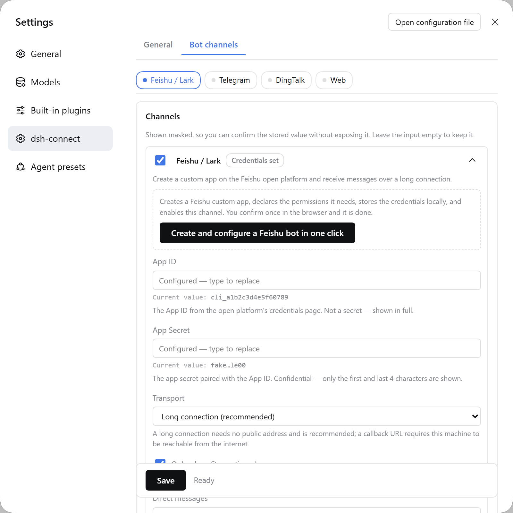
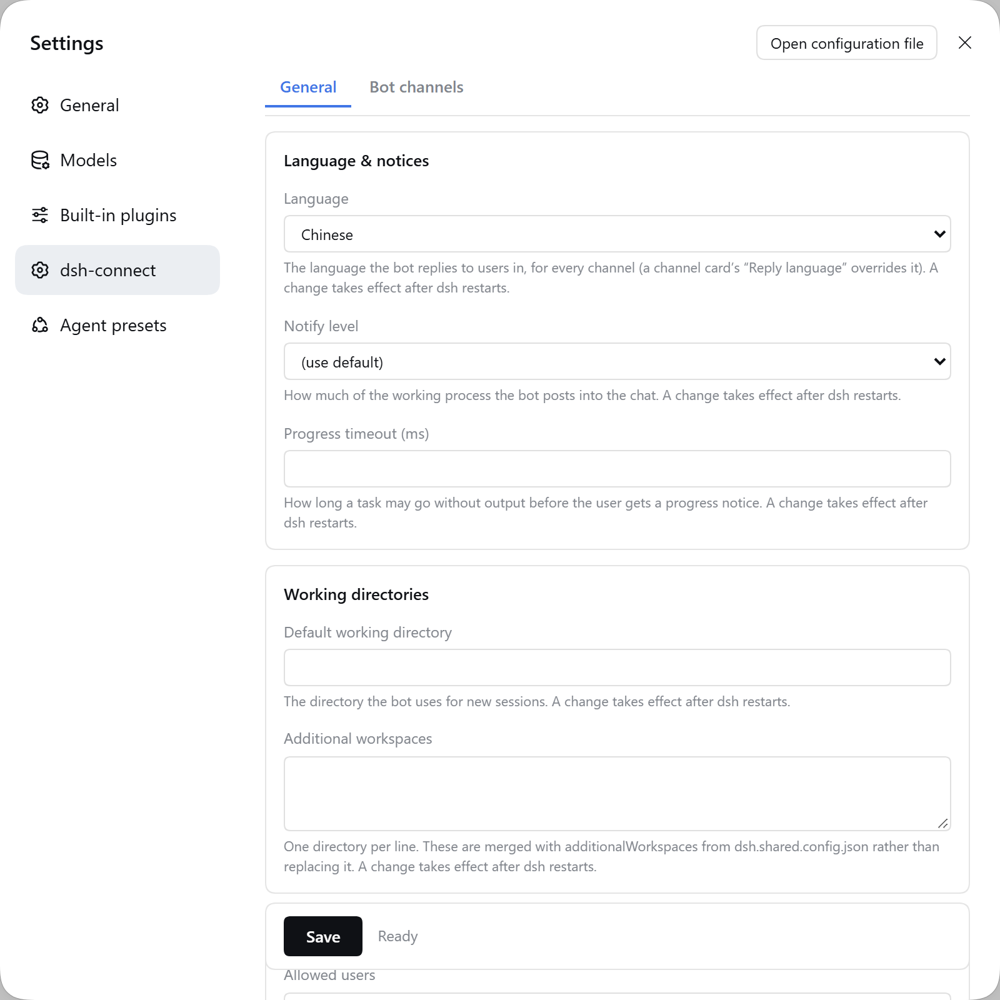
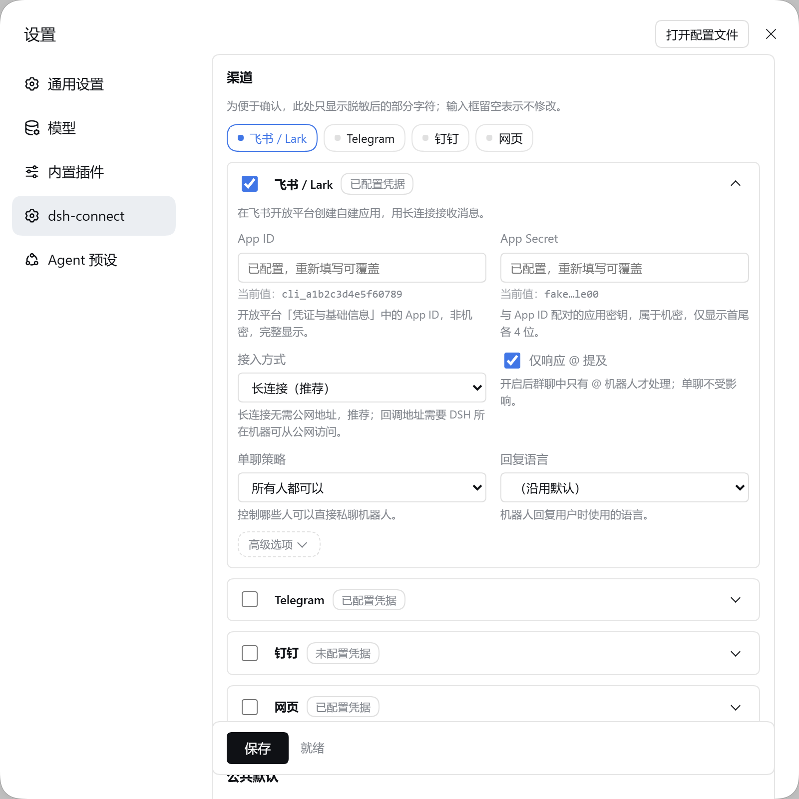
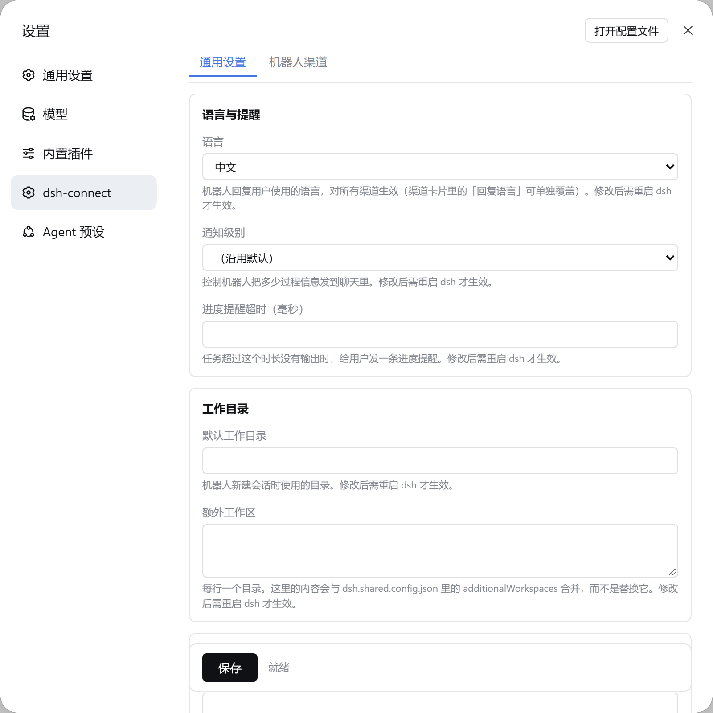
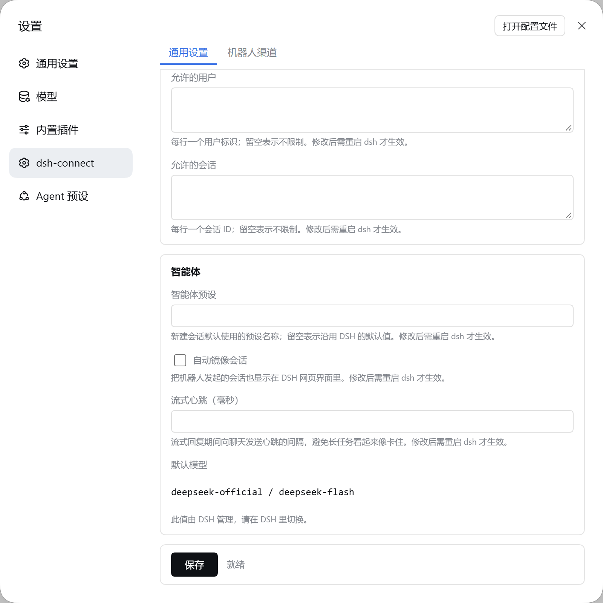
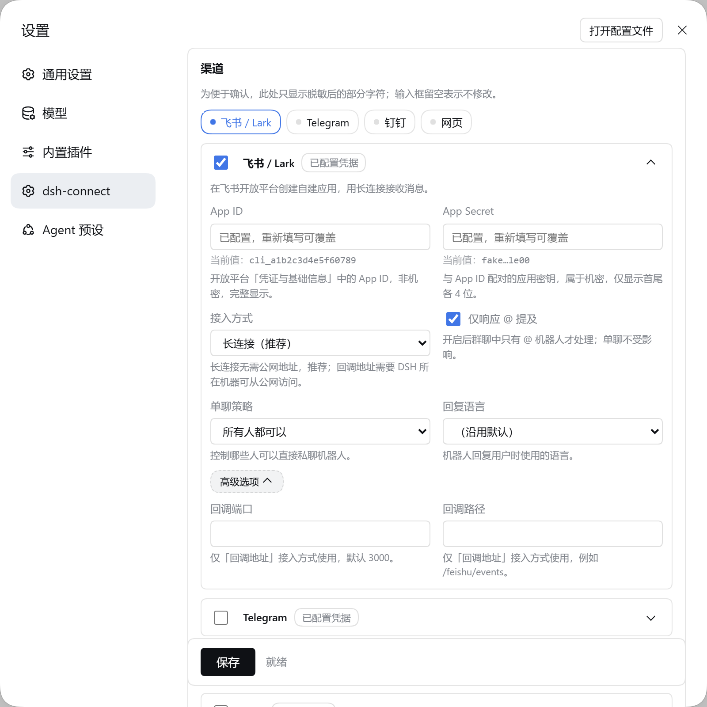
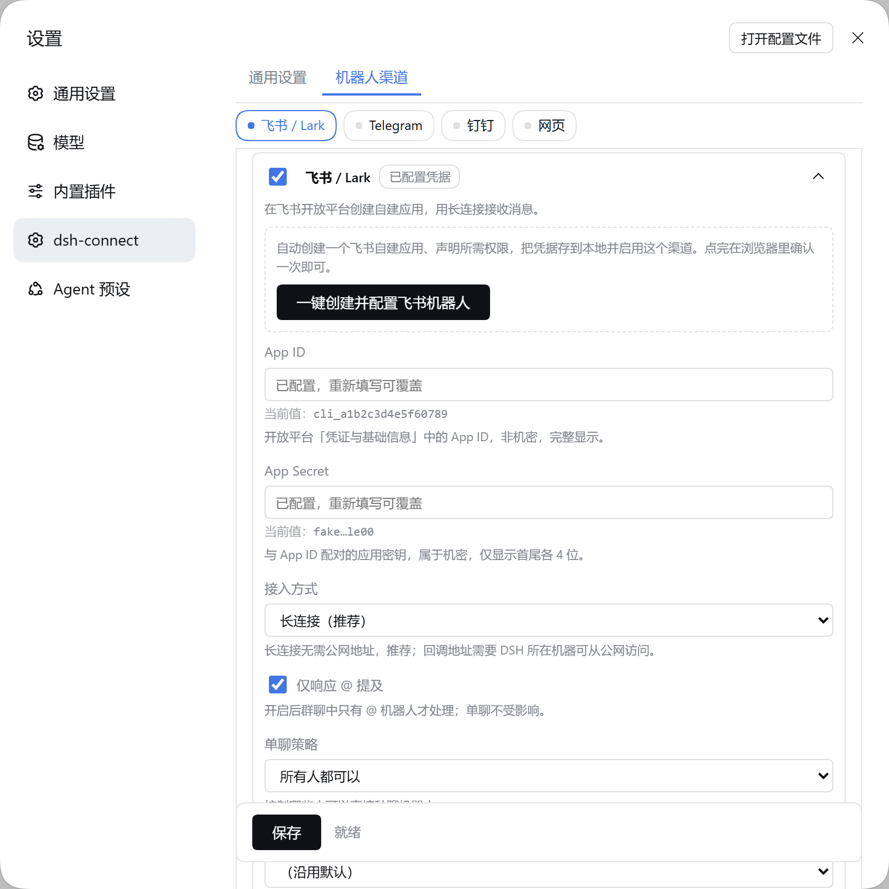
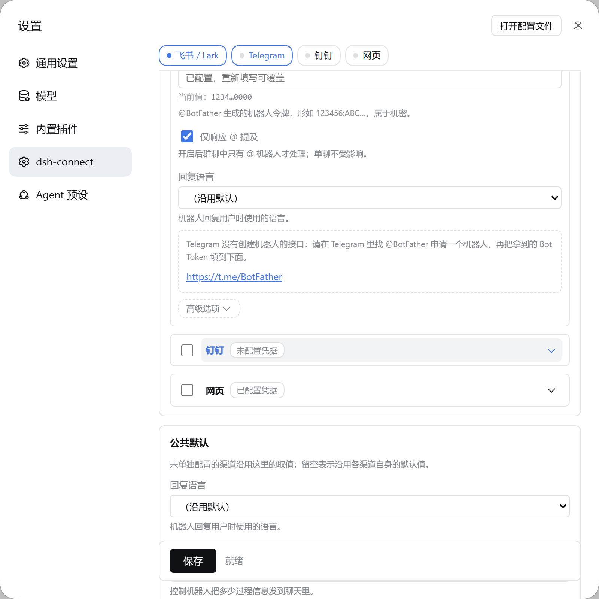
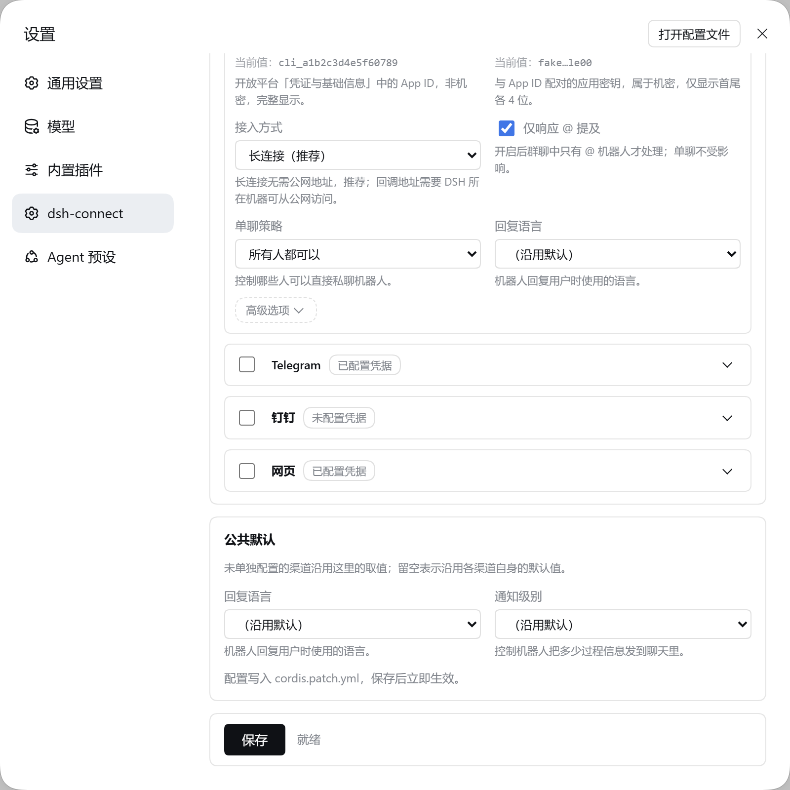

# dsh-connect

English | [中文](README.zh.md)

The **all-in-one plugin** for connecting [DeepSeek Harness](https://github.com/deepseek-ai/deepseek-harness) (**DSH**) agents to chat platforms (Feishu / Lark, Telegram, DingTalk, and the Web mirror; more to come): session binding, agent driving, streaming reply bridging, interactive menu cards, local commands, and the web-settings stack.

> One install, one config block: the core `connect` service, every channel adapter (feishu / telegram / dingtalk / web), and the web-settings stack all live in this single package. Enable the channels you use via the `channels` selector. The former split packages (`dsh-connect-feishu`, `dsh-connect-telegram`, `dsh-connect-dingtalk`, `dsh-connect-web`) and the `dsh-connect-all` bundle no longer exist.

### What it looks like

The settings pane is where you configure channels and credentials — the full walkthrough
is [further down](#the-settings-pane):

| Overview | General |
|---|---|
|  |  |

> **Not shown here: the chat itself.** Screenshots of the conversation — the streaming
> card, the reasoning and tool-call lines, the question buttons — are not included yet.
> I would rather say so than present a settings pane as if it were the product. If you
> want to see it before installing, the [Quick start](#quick-start) describes the exact
> sequence of what appears in the chat, step by step.

## Why this exists

DSH's own Web GUI is excellent, and nothing here replaces it. What it cannot do is reach
you. An agent that runs for twenty minutes on a long refactor has no way to tap you on the
shoulder while you are in a meeting, on a phone, or away from the machine — and you have no
way to answer it when it stops to ask a question.

`dsh-connect` closes that loop. The agent keeps working in a real DSH session on the real
host; you get a **native chat client** as the control surface:

- **Start work from anywhere, on any device.** Feishu, Telegram and DingTalk all have
  mature mobile and desktop clients. You are not tunneling into a web UI or keeping a tab
  open; you message the bot the way you message a colleague.
- **Watch it work, or don't.** The chat card streams the reasoning and tool calls live, so
  a long turn is legible instead of a spinner. When you would rather not read it, drop the
  chat to `输出重要节点` or `只输出结果` and get the answer once, whole, at the end.
- **Answer the agent where the question appears.** When the agent needs a decision
  (`ask_user_question`) or permission for a risky action, the question arrives as buttons
  in the same conversation. Answering from chat is a first-class path, not a fallback —
  and the Web GUI stays fully functional, so whoever answers first wins.
- **Keep the audit trail in the conversation.** Every task, result and approval is a
  message you can scroll, search and forward, in a tool your team already has.

Two properties make this usable rather than a demo:

1. **It is the real agent, not a chat wrapper.** Sessions live in DSH and are bound 1:1 to
   chats; the same session is simultaneously visible in the Web GUI as a mirror. Switch
   between the two freely — the transcript, working directory and context are the same
   object, not a copy.
2. **The quiet levels are genuinely quiet.** Only `full` sends repeating status lines.
   The two quieter levels send discrete events only — this is asserted by tests, because
   "notifications you cannot turn off" is the failure mode that makes people uninstall a
   bot.

**Who it is for.** Anyone running DSH who wants to operate agents from a chat platform —
solo operators running a bot for their own workspaces, and small teams sharing one bot in
group chats behind an allowlist.

## Overview

`dsh-connect` binds a chat conversation to a DSH agent session and drives it end to end:

- **Session binding & routing** — one chat ⇄ one agent session, persisted in a `bindings.json` route store; sessions can be created, resumed, switched, cleared and mirrored to the DSH Web GUI.
- **Streaming replies** — the model's live deltas are bridged into the channel's native streaming (Feishu typewriter cards): the thinking hint opens the reasoning phase, reasoning streams live with readable paragraph breaks, tool calls appear as `🔧` progress lines, and a liveness heartbeat keeps the card moving even through long silent stretches (long first-token waits, heavy tool runs) so it never sits frozen on "Thinking…". The runner keeps two subscriptions, because `0.1.5-rc.2` split what used to be one: the durable `session/event` stream carries turns, tools and settlement, while the transient `agent/assistant-stream` frames carry the deltas — the `assistant/chunk` session event that used to carry both is gone.
- **Notification levels** — per-chat control over how much of the process is streamed: `尽量输出过程` (full process) / `输出重要节点` (key milestones) / `只输出结果` (result only). **Only `full` sends repeating status lines**; the two quieter levels send discrete events instead (see the table below). Switch any time via the settings menu or `/notify`; the choice is persisted per chat and applies immediately.
| Level | Thinking hint | Reasoning text | Tool-call lines | Liveness heartbeat | 5-min progress reminder | Final answer |
|---|---|---|---|---|---|---|
| `尽量输出过程` `full` | once | streamed live | streamed live | sent on a timer | sent, with the step count | streamed live |
| `输出重要节点` `important` | once | not sent | not sent | **not sent** | **sent**, with the step count | sent once, whole, at task end |
| `只输出结果` `result` (default) | not sent | not sent | not sent | **not sent** | **sent**, with the step count | sent once, whole, at task end |

The **liveness heartbeat** is repeating chatter ("still here"), so only `full` gets it. The **5-minute progress reminder** is a status report you configured with `progressTimeoutMs`, so it runs at every level — set it to `0` to turn it off everywhere. Both edit the streaming card in place rather than posting a new bubble.

- **Automatic context compaction** — optional, off by default. With `autoCompact` on, a session is compacted automatically at the end of a turn once context usage reaches `autoCompactThresholdPct` (default 80%), so a long unattended run does not stop on a full window. The task-end card states which rule is active. Toggle it per chat with `/autocompact on|off|<1-99>`.
- **Task-end stats** — after every task a compact card reports the model used, input/output tokens, elapsed time and context-window usage, and suggests `/compact` when the context is getting full.
- **Interactive menus** — button cards for status, tasks, history, goals, schedule, model/effort switching, workspace picking, language, and more (see the in-chat `/` commands).
- **Media handling** — downloads user images/attachments, passes them to a vision-capable model (or a configured vision model) so text-only main models never stall on images.
- **Locking & queuing** — per-chat write locks coordinate Feishu and Web writers; queued messages drain when the lock releases.
- **Web mirror (auto)** — every Feishu conversation is automatically available in the DSH Web GUI as a mirrored session (disable with `autoMirror: false`).

**Who is it for?** Anyone running DSH who wants to operate agents from a chat platform — solo operators running a bot for their own workspaces, and small teams sharing a bot in group chats with an allowlist.

## Compatibility

| Aspect | Value |
|---|---|
| DSH version | `^0.2.0-rc.2` (peer `@deepseek-ai/dsh-agent`, `dsh-llm`, `dsh-session`) |
| Cordis | `^4.0.1` |
| Node.js | ≥ 20 (ESM, `NodeNext`) |
| Last verified | **2026-10-10** against DSH `0.2.0-rc.2` on Windows — host load, Feishu WebSocket transport, the web-settings pane, and an end-to-end round trip against a live `dsh` host (the E2E suite's live leg) |

**Keep the peer range in step with the host.** Upstream ships no changelog or
migration guide, so a stale range is the only thing standing between this plugin
and silent breakage: DSH `0.1.5-rc.2` deleted the `Session.events` accessor and
the `assistant/chunk` event type outright, and every `dsh-*` package is versioned
on the same line. When you upgrade DSH, bump `peerDependencies` (and
`devDependencies`) for `dsh-agent`, `dsh-llm` and `dsh-session` together, re-run
`tsc`, and re-run the test suite — a range that no longer overlaps the host
version is the signal that the bridge needs another migration.

DSH refuses to load a plugin whose range does not cover it, so a stale range is
at least loud: installing `0.9.0` on `0.2.0-rc.2` is rejected with *"may cause
crashes or data loss"* before anything runs. `0.9.3` is the version that covers
`0.2.0-rc.2`; see [Upgrading from 0.9.0](#upgrading-from-090).

The plugin runs on the DSH **Host plane** (process-level singleton services), not inside an agent preset.

## Install / Uninstall

Plugin management is a thin wrapper over pnpm in the DSH profile:

```sh
# Install the single all-in-one plugin (core + all channel adapters + web-settings)
dsh plugin --profile web add dsh-connect
```

**Upgrade**

```sh
dsh plugin --profile web update dsh-connect
```

**Disable** — override the bundle-registered entry with `disabled: true` in the profile patch (see `~/.dsh/profiles/<profile>/cordis.patch.yml`):

```yaml
- id: connect
  name: dsh-connect
  disabled: true
```

**Complete removal** — uninstall the package and delete the data it created:

```sh
dsh plugin --profile web remove dsh-connect
# then remove the plugin data (see "Permissions & data" below):
rm -rf .dsh-connect            # binding route store (stateDir)
rm -f ~/.dsh/.dsh-connect/feishu-credentials.json
```

### Installing in the Desktop app

The Desktop app carries its own reserved profile (`desktop`) and installs into
it from its own UI, not from a terminal: **`dsh plugin --profile desktop …` is
refused** with *profile "desktop" is managed exclusively by the Electron
application*, because only the app's own carrier is allowed to manage that
profile. In the app, the install surface is a **sidebar panel named Plugins** —
the first entry in the sidebar's panel list — whose header button **Add plugin**
takes a package name. The app then tells you when it applies: *changes take
effect on next start*.

Settings is **not** where that lives. Settings has two read-only pages instead —
**Bundled plugins** (the built-in list and their status) and **Plugin list**
(session plugins / global plugins) — which is exactly where the Plugins page's
own help line points: *the built-in plugin list and their status are under
Settings → Bundled plugins*.

`dsh-connect`'s own pane (**Settings → dsh-connect**) appears only once the
plugin is actually installed and loaded, so a refused install leaves nothing to
find there yet.

### When the install resolves to an older version

Two pnpm 12 behaviours bite a fresh install, and both look like a lie: the
Desktop plugin list offers the newest version, yet what lands on disk is the one
before it — or the install ends in `ERR_PNPM_IGNORED_BUILDS` while still leaving
the dependency in `package.json`.

1. **pnpm's built-in 24-hour release cooldown.** `minimumReleaseAge` defaults to
   1440 minutes and is **non-strict**: a bare `add dsh-connect` resolves to the
   newest release *older than 24 hours*. The version query the Desktop shows you
   is a read, not an install, so it is not subject to the policy — for one day
   after every publish the two legitimately disagree.
2. **An undecided build script.** `protobufjs`, reached through
   `@larksuiteoapi/node-sdk`, has a build script pnpm 12 will not run until you
   decide about it. It reports that *after* writing the dependency, which is why
   the failure looks like a half-finished install.

Append this to the profile's `pnpm-workspace.yaml`
(`$DSH_HOME/profiles/web/pnpm-workspace.yaml`; on Windows the Desktop app's
profile is `%USERPROFILE%\.dsh\profiles\desktop\pnpm-workspace.yaml`), then
install again:

```yaml
minimumReleaseAgeExclude:
  - dsh-connect
allowBuilds:
  protobufjs: false
```

`minimumReleaseAgeExclude` exempts **only this package**; prefer it to
`minimumReleaseAge: 0`, which turns the 24-hour supply-chain protection off for
everything in the profile. `allowBuilds` is the spelling pnpm 12 accepts —
`onlyBuiltDependencies` and `ignoredBuiltDependencies` no longer work and still
fail with the same error.

The exemption cannot ship inside `dsh-connect`: a package cannot grant its own
transitive build allowance from its own manifest, so the consuming profile is
the only place it can live.

The two remedies are not interchangeable. Naming the version explicitly —
`dsh plugin --profile web add dsh-connect@<version>` — does defeat the cooldown
on its own, but it does **nothing** for the build script: that install still
ends in `ERR_PNPM_IGNORED_BUILDS`, because `allowBuilds` is the only thing that
decides `protobufjs`. If you would rather not edit the profile at all, the pin
gets you the right *version*; it does not get you a clean exit.

Two more things worth knowing:

- **Uninstall before reinstalling.** DSH rejects a second `add` of an installed
  plugin with `already-installed`, so remove it first.
- **Restart `dsh`** (or the Desktop app) afterwards: host plugins load at
  process start.

## Quick start

1. **Install the plugins** (see above).
2. **Add the minimal config** to `~/.dsh/profiles/<profile>/cordis.patch.yml` — the shape is also in [`examples/minimal.config.json`](examples/minimal.config.json), and the fully commented version is [`examples/profile-cordis.patch.yml`](https://github.com/IvanWu2015/dsh-connect/blob/main/examples/profile-cordis.patch.yml) in the repository (that path is outside the published tarball, hence the absolute link). The plugin registers itself via its bundle manifest, so only override its config — do **not** `insert` it again (a duplicate id crashes dsh at boot):

   ```yaml
   - id: connect
     name: dsh-connect
     # workDir: D:\your\workdir     # agent working directory (default: process cwd)
     config:
       channels: [feishu]            # which channels to activate; omit = all built-in
       # channelDefaults: { language: zh }   # keys applied to every channel that doesn't set its own
       feishu:
         appId: cli_xxxx
         appSecret: cli_secret_xxxx
         transport: websocket
         requireMention: true
         dmMode: open
   ```

3. **Start the host** — `dsh web` (or `dsh run`). With no credentials configured, the `feishu` channel enters **one-click onboarding**: scan the QR / open the link from the log to authorize the bot.
4. **Send a message** to the bot in Feishu. The bot replies with a streaming card; `/help` lists all commands; the conversation also appears in the DSH Web GUI automatically (auto-mirror).

A fully reproducible example is the [`examples/`](examples/) folder plus the repository's [Feishu setup manual](https://github.com/IvanWu2015/dsh-connect/blob/main/docs/feishu-setup.md) (Feishu app creation, event subscriptions, publishing).

## Questions and approvals in a conversation

When the agent needs a decision from you it stops and asks, and the asking happens in the chat — no switching to the Web GUI:

- **A question with options** renders as a card with one button per option. One tap answers it and the card immediately moves on to the next question. **Once every question is answered the card is replaced by a summary** of each question and the answer given, and the buttons disappear — leaving them live made the card look like it was still waiting, and a tap on one did nothing at all, because a tap on a retired card is deliberately absorbed rather than reported as expired.
- **A question without options** has no buttons to offer: the bot sends the question as a prompt and you **reply in the chat**. That message is the answer.
- **A tool approval** (an action that needs your go-ahead) is a card too, with **Allow once** / **Reject** buttons. This one accepts **only a tap** — a plain chat message sent while an approval is waiting is not recorded as its result.

One chat holds one pending card at a time. A second request is handed back to the host's own path (the Web GUI) rather than fighting the first card for the same message — and so is a card that could not be delivered, or a request cancelled before you answered; in each case the chat is **released**, because a leaked pending entry would silently swallow your next message.

"This action is no longer active" means the card has expired — it auto-closes after 60 s idle, so ask again. A double tap, or a tap landing right after the previous question was answered, falls inside the card's redraw window and is ignored silently rather than misreported as expired.

## Configuration

Configuration lives in the DSH profile patch (`cordis.patch.yml`) under the plugin's `config:`. `dsh.shared.config.json` in the project root (or its parent) can supply workspace/state defaults that take precedence for those keys.

### `dsh-connect` (core)

| Key | Default | Description |
|---|---|---|
| `agentPreset` | roster default | Agent preset id composed into each bound session. Resolution is best-effort: the configured id is tried, then `standard` (or the roster's first mountable row), and if neither composes the agent is built without a preset so the turn still runs. A stale id therefore degrades instead of failing every message — it is logged, not thrown. |
| `workDir` | process cwd | Absolute working directory for each bound agent |
| `workspaces` | `[]` | Extra workspaces offered by the `/dir` picker |
| `visionModel` | auto-detected | `{ provider, model }` used to describe images when the main model can't see them |
| `language` | `zh` | User-facing message language: `zh` / `en` |
| `allowUsers` | `[]` | **Fallback** sender allowlist, used only by a channel that sets none of its own. Identifiers are channel-specific, so each channel has its own list on its card; a channel declaring an empty list allows everyone, overriding this |
| `allowChats` | `[]` | **Fallback** chat allowlist; a channel's own list wins. See `allowUsers` |
| `<channel>.allowUsers` | `[]` | That channel's sender allowlist, in that channel's own id format (Feishu `ou_…`, Telegram numeric). Empty = no restriction for this channel; absent = use the fallback above |
| `<channel>.allowChats` | `[]` | That channel's chat allowlist. Empty = every chat; absent = use the fallback |
| `stateDir` | `.dsh-connect` | Directory holding the `bindings.json` route store (env `DSH_CONNECT_STATE_DIR` overrides) |
| `autoMirror` | `true` | Automatically create a Web GUI mirror for every new session |
| `streamHeartbeatMs` | `60000` | Liveness heartbeat interval (ms) for the streaming card; `0` disables it |
| `autoCompact` | `false` | Compact the session automatically at the end of a turn once context usage reaches `autoCompactThresholdPct`. Off by default: compaction rewrites the history. Per-chat override via `/autocompact on\|off` |
| `autoCompactThresholdPct` | `80` | Context-window usage (the same percentage the task-end card reports) at which `autoCompact` fires; clamped to 1–99. Per-chat override via `/autocompact <1-99>` |
| `notifyLevel` | `result` | Default notification level: `full` (stream everything) / `important` (key milestones) / `result` (answer only, the default); per-chat override via settings menu or `/notify` |
| `progressTimeoutMs` | `300000` | Proactive progress-notice interval (ms): when a turn has sent no standalone card/text for this long, a status card reports the latest milestone; `0` disables; per-chat override via settings menu or `/progress`. **Runs at every notification level** — it is a status report you configured, not liveness chatter (which is the separate, `full`-only heartbeat). Its milestone is a tool-free step count. `0` disables it everywhere |

### Shared (all channels)

| Key | Default | Description |
|---|---|---|
| `channels` | all built-in | Which channels to activate: `feishu` / `telegram` / `dingtalk` / `web`. Omit to activate all built-in channels. |
| `channelDefaults` | `{}` | Keys applied to every channel that doesn't set its own (e.g. `{ language: "zh" }`). |
| `settingsStatePath` | `<stateDir>/dsh-connect-settings.json` | Where the web-settings pane mirrors non-secret config. Defaults to `dsh-connect-settings.json` *inside* `stateDir`, so it lands beside `bindings.json` and can never disagree with the stores; set it to override. The pane's authoritative store is this plugin's entry in the active profile patch (see [User settings](#user-settings)); this file is only the compatibility mirror the legacy `/dsh-connect` RPC reads and writes, and a pre-0.2 install's copy of it is read back once by the upgrade (see [Upgrading from 0.9.0](#upgrading-from-090)). |

### `feishu` (Feishu / Lark channel)

| Key | Default | Description |
|---|---|---|
| `appId` | env `FEISHU_APP_ID` | Feishu custom app id (**secret**) |
| `appSecret` | env `FEISHU_APP_SECRET` | Feishu custom app secret (**secret**) |
| `transport` | `websocket` | `websocket` = long connection (no public network); `webhook` needs public HTTPS |
| `verificationToken` | — | Webhook verification token (**secret**) |
| `encryptKey` | — | Webhook encrypt key (**secret**) |
| `webhookPort` | `9000` | HTTP port for the built-in webhook server when `transport: "webhook"` |
| `webhookPath` | `/` | URL path the Feishu event callback posts to (webhook transport) |
| `requireMention` | `true` | Groups only respond when the bot is @mentioned |
| `dmMode` | `open` | DM policy: `open` / `allowlist` / `pair` / `disabled` |
| `language` | `zh` | User-facing message language: `zh` / `en` |

**Environment variables**

| Variable | Purpose |
|---|---|
| `FEISHU_APP_ID` / `FEISHU_APP_SECRET` | Feishu credentials — preferred over putting secrets in config files |
| `DSH_CONNECT_STATE_DIR` | Overrides `stateDir` for the binding store |
| `DSH_HOME` | Overrides the `~/.dsh` base for credential files |

**Sensitive items** — `appSecret`, `verificationToken`, `encryptKey`, and `feishu-credentials.json`. Prefer environment variables or one-click onboarding; keep them out of version control.

**Creating the app.** Two one-click entry points (1.0.0): the button in the [settings pane](#the-settings-pane), and — from a terminal — starting the plugin with no credentials, which prints an onboarding link. Both create the app with its permissions and event preset and store the credentials in the DSH credential store; the pane additionally enables the channel and pins `transport: websocket`. The CLI path is skipped when `onboarding: false` or stdout is not a terminal, so a headless service never starts a flow nobody can answer. Telegram and DingTalk have no such API — the pane links to their official creation pages instead.

### `telegram` (Telegram channel)

| Key | Default | Description |
|---|---|---|
| `botToken` | env `TELEGRAM_BOT_TOKEN` | Telegram bot token from @BotFather (**secret**) |
| `requireMention` | `true` | Groups only respond when the bot is @mentioned (or replying to the bot's own message) |
| `pollingTimeoutSeconds` | `50` | `getUpdates` long-poll timeout in seconds |
| `baseUrl` | — | Optional Bot API base URL override (e.g. a local Bot API server) |
| `language` | `zh` | User-facing message language: `zh` / `en` |

### `dingtalk` (DingTalk channel)

| Key | Default | Description |
|---|---|---|
| `webhookUrl` | env `DINGTALK_WEBHOOK_URL` | Group custom-robot webhook URL (proactive push) |
| `secret` | env `DINGTALK_WEBHOOK_SECRET` | Signing secret (`SEC…`) only when signing is enabled |
| `stream.clientId` / `stream.clientSecret` | env `DINGTALK_STREAM_CLIENT_ID` / `DINGTALK_STREAM_CLIENT_SECRET` | Bidirectional stream-mode app credentials (**secret**, nested under `stream`) |
| `stream.requireMention` | `true` | Group replies need an @-mention (stream mode) |
| `defaultAt` | — | Default @-mentions merged into every push (`{ mobiles, userIds, all }`) |
| `language` | `zh` | User-facing message language: `zh` / `en` |

### `web` (Web mirror channel)

| Key | Default | Description |
|---|---|---|
| `pollIntervalMs` | `1000` | Mirror-session polling interval (ms) |

Environment variables (`FEISHU_*`, `TELEGRAM_*`, `DINGTALK_*`, `DSH_CONNECT_STATE_DIR`, `DSH_HOME`) and the DSH credential store are the preferred way to supply per-channel secrets — the web settings pane writes them to the credential store and `injectSecrets` populates them on load.

## Permissions & data

- **Files written**
  - `<stateDir>/bindings.json` (default `.dsh-connect/`) — the chat ⇄ session route store (chat keys, session ids, mirror and lock state).
  - `<stateDir>/dsh-connect-settings.json` (default `.dsh-connect/`) — the non-secret compatibility mirror, see `settingsStatePath`.
  - `<profile dir>/.dsh-connect-legacy-imported` — a marker recording that the one-shot upgrade import ran. It sits beside the profile entry the import writes to (see [Upgrading from 0.9.0](#upgrading-from-090)), and its contents are a sentence saying where the settings came from; nothing is stored in it.
  - this plugin's entry in the active **profile patch** (`profileContext.patchPath`, `cordis.patch.yml`) — written through DSH's first-party `settings` service (atomic, file-locked, comment-preserving).
  - `~/.dsh/.dsh-connect/feishu-credentials.json` — **legacy**, read-only. One-click onboarding used to save Feishu credentials here instead of the credential store, so a user who had just scanned the QR code still saw `未配置凭据` forever. Onboarding now writes to the credential store, and an existing install is backfilled from this file once on boot; after that it is never read or written again.
  - `<workDir>/.dsh-connect-images/` — user images/attachments staged for the agent's tools.
  - DSH's own session logs and settings under `~/.dsh/` (sessions, settings, etc.).
- **Network**
  - Feishu Open Platform: WebSocket long connection (or webhook over public HTTPS), plus HTTPS API calls (media download, cards).
  - LLM provider APIs used by DSH for the agent's model (e.g. DeepSeek), plus the optional vision model.
- **User data** — message text and attachments flow through the bot to the agent session; they are stored in the DSH session log like any DSH conversation. The allowlists (`allowUsers` / `allowChats`) limit who can drive the bot.

## The settings pane

`dsh-connect` adds its own page under **Settings → dsh-connect**, with a
two-level navigation: a primary strip (**General** first, **Bot channels**
second) over the channel view's own tab strip of collapsible cards. Each card is
headed by a button, its low-frequency fields sit behind a second-level
**Advanced** fold, and Save/status stay pinned to the bottom of the scroll
region. Both strips are pinned — `position: sticky` at the top of the scroll
region, so content scrolls under them rather than carrying them off-screen.
Settings are one per row: the field grid is a single column, so the
label/control pairs never reflow into two or three columns as the pane widens.

The pane **opens on Bot channels**, so the one-click Feishu button is zero clicks
away; it sits at the very top of the Feishu card body, above App ID / App Secret.
**General** is the ten values that used to be reachable only through chat
commands — reply language, notification level, progress watchdog, working
directory and extra workspaces, the allow-lists, the agent preset, mirror and
heartbeat. They are editable here, but unlike channel settings they are read once
when the plugin loads: every field says so, and a change takes effect after `dsh`
restarts. A key that `dsh.shared.config.json` actually overrides carries a note
saying the pane cannot win; the current model is shown read-only, because DSH
owns it and switching it belongs inside DSH.

Every channel card is headed by **two badges** (1.0.5). The first is the
credentials badge — whether the channel *has* the credentials it needs, which is
what it has always meant. The second is **access status**, answering a different
question: whether the bot is *connected right now*. It reads
`Connected / Connecting / Reconnecting (attempt N) / Idle / Running / Not running /
Connection failed / Not enabled`, and the card's issue bar below carries the
adapter's own reason when something failed. **Only Feishu reports a real
transport state** (`LarkChannel.getConnectionStatus()`); the other three have no
probe to ask, so they report only what the runtime can evidence rather than
inventing a "connected" nobody checked. When the host offers no status at all,
the second badge is not rendered — an 「unknown」 placeholder would be a claim.
The channels view polls while it is open, so a reconnect appears on its own; the
poll merges the status keys only, which is what keeps it from overwriting edits
you have not saved yet.

> The captures below were taken before 1.0.5, so each channel header shows only the
> **credentials** badge; the **access status** badge described above renders beside it
> at runtime. The two-badge header is covered by the client-bundle tests rather than
> a screenshot.

| Channels & credentials | General |
|---|---|
|  |  |

| General: the read-only model row | Advanced fields opened |
|---|---|
|  |  |

| Feishu card: credentials, one-click button above | Telegram card: official entry link |
|---|---|
|  |  |



English captures: [overview](docs/images/settings-overview-en.png) · [general](docs/images/settings-general-en.png) · [general: model row](docs/images/settings-general-agent-en.png) · [advanced](docs/images/settings-advanced-en.png) · [defaults](docs/images/settings-defaults-en.png) · [Feishu credentials](docs/images/settings-feishu-en.png) · [official entry](docs/images/settings-manual-en.png).

> Captured from a throwaway profile whose credentials are all placeholders. Nothing
> above contains a real secret — and it could not, because the host masks every
> stored value before it reaches the browser (see [below](#seeing-and-masking-stored-values)).

Cards default to the channels you have enabled (the first one, if none are), and
clicking a tab opens that card and scrolls it into view *without* closing the
others — several open at once is a legitimate state. Collapsing a card unmounts
its body rather than hiding it, which is safe because an unsaved secret you typed
lives in the pane's own state, not in the card. Ticking a channel's enable box
opens it too.

The Feishu card carries a **Create and configure a Feishu bot in one click** button (1.0.0), at the
very top of the card body — above App ID / App Secret, so the automated path comes before the manual
one instead of after it. The
host runs Feishu's official OAuth 2.0 device-authorization flow: the button hands you a link to open
in a browser, the app is created there with its permissions and message-receive event preset, the
credentials go into the DSH credential store, and `feishu` is added to `channels` with
`transport: websocket` — reachable without a public URL. **Telegram and DingTalk have no equivalent
API**, so their cards show a link to the official creation page
([@BotFather](https://t.me/BotFather) / [open-dev.dingtalk.com](https://open-dev.dingtalk.com/)) and
an instruction to paste what it returns into the fields below. Nothing about those two is automated.

The result is a list of separate facts in the save bar, never a single "done": app created (with its
`appId`) / credentials stored / channel enabled / whether the *running* channels reloaded in place /
the event-subscription outcome / what is left for you in the vendor console. Credentials-stored and
channel-not-reloaded are always two lines — a saved credential the live adapter has not picked up is
a state you need to know about, and restarting `dsh` applies it. The subscription patch is
best-effort by design: the SDK notes it may apply only to apps created in the developer console, and
most configuration changes there need a published version before they take effect. This plugin never
publishes on your behalf and never claims the subscription is live.

## User settings

The web settings pane (`dsh-connect` under **Settings**) edits **this plugin's
entry in the active profile patch** — the same
`~/.dsh/profiles/<profile>/cordis.patch.yml` you would edit by hand — through
DSH's own first-party `settings` service. That service writes atomically under a
file lock and preserves your comments, and the loader hot-reloads the result.
**Channel settings therefore take effect immediately; the general settings do
not** — `workDir`, `language`, `notifyLevel`, `progressTimeoutMs`, `workspaces`,
the two allowlists, `agentPreset` and `streamHeartbeatMs` are read when the
plugin loads, so they need a restart of `dsh`. Every one of them says so on its
own row in the pane.

The fields the pane owns are declared `volatile` in the plugin's config schema.
That declaration is what makes a save *reconcile* instead of remounting: the
loader hands the plugin a live reference for each declared field, and a settings
write commits them in place, so the running adapters pick the values up on their
next message. Fields the pane does not own are simply not declared — which is
the mechanism that keeps it from writing them.

Values resolve in three layers, most specific last:

1. the schema defaults shipped with the plugin;
2. the config the plugin is composed with (its inherited entry);
3. this plugin's entry in the active profile patch — both what you hand-write
   there and what the pane saves.

A save is projected onto the declared fields only, so an undeclared key — a
credential, `settingsStatePath`, something you added yourself — cannot reach the
document even if a caller sends it. The converse is load-bearing too: the host
resets a declared field that an update *omits* to its inherited value, so a save
always writes the complete declared section. Undeclared keys you hand-wrote in
that entry are preserved across a pane save, untouched.

**Consequence worth knowing: pressing Save pins the channel list.** `channels` is
a declared field, so the section a save writes names every channel that was in
the form at that moment — and there is no way to unpin it from the pane, because
an omitted field does not clear but *inherits*. If you have saved at least once,
a channel added by a newer release will not be enabled for you until you tick it
and save again (or delete the `channels` key from
`~/.dsh/profiles/<profile>/cordis.patch.yml` by hand). The pane cannot tell the
difference between "the user chose this list" and "the user has not looked since
the list changed", and it will not guess on your behalf: a save that wrote only
what you edited would reset every other field to its inherited value.

**The pane never writes credentials.** A profile patch is a plain document users
are invited to paste into bug reports, so a secret you type into the pane goes to
the DSH credential store (`ctx.credentials`) instead — which is also where
one-click onboarding and the `FEISHU_*`-style environment variables put them. A
secret you hand-wrote in the entry yourself is left where it is.

The legacy `/dsh-connect` HTTP RPC is retained for panel compatibility; it now
reads and writes the same namespace, and mirrors non-secret config to
`settingsStatePath` (see [Shared](#shared-all-channels)) for older panels.

### Seeing and masking stored values

The pane shows each stored credential as a read-only *current value* line under
its input (`not configured` when nothing is stored), so you can confirm what you
configured without retyping it. **The masking happens on the host**, in one shared table
(`src/settings/secret-disclosure.ts`) that both the host and the pane read — the
pane only decides whether to render the input as a `password` or a `text` field,
so the display and the policy cannot drift apart.

| Field | How it is shown |
|---|---|
| `appId`, `clientId` | **In full.** These are identifiers, not authenticators: they appear in every outbound API call and in the vendor console, so hiding them protects nothing. |
| `appSecret`, `clientSecret`, `botToken`, `secret` | Head and tail only — `a1b2…z9y8`. Values too short to survive partial disclosure show a fixed `••••••` instead. |
| `webhookUrl` (DingTalk) | URL-aware. Origin, path and parameter *names* are kept and only the token's middle is masked, because DingTalk puts the token in the query string — masking the whole URL (`https…bcde`) would confirm nothing. |
| any other key | Masked by default. |

Two properties hold regardless:

- **No usable secret crosses the wire.** The value is masked before it leaves the
  host, so a browser tab — or a screenshot of one — never holds one.
- **A mask can never be written back.** The preview is text *beside* the input,
  never the input's value. Inputs always start blank; blank means "leave the
  stored value alone", so saving the config alone writes no credential at all.

The pane's own strings (channel names, field labels, option text, status) all
come from `client/locale.mjs`, which ships `zh` and `en`. A test asserts both
languages cover exactly the same key set — the host resolves a missing key by
silently falling back to the other language, so an untranslated string shows up
as mixed-language text rather than as an error.

### When a save has something to report

`已保存` / `Saved` means the write landed, and nothing more. When there is
something else to say, the save bar grows a list above the button — it is the
only part of the pane that is always on screen, and a channel card can be folded
or scrolled past, which is exactly when a bare "Saved" next to nothing else
misleads.

| Line | What it means |
|---|---|
| *<channel>* · `Credential state unknown` | The credential store could not be **read** for that channel — usually a permission problem or a malformed store. This is not `not configured`: a secret may well be stored. Do not retype it until you have checked the store, which is why the badge on that channel's card turns amber rather than red. |
| *<channel>* · `Channel failed to start:` plus the adapter's own message | The adapter's `start()` threw. The message is passed through verbatim, because it is the only part that names the credential or option actually at fault. |
| `The credential was saved, but the running channels did not reload it — restart dsh to be sure.` | The save partially applied: the secret is in the credential store, but the reconcile that hands it to the running adapters failed, so the bot keeps using the old one until a restart. |

Warnings accumulate across the several calls one Save makes (config first, then
each channel's credentials); the error lines are re-derived from the world on
every call. A warning is about the call that raised it, so it would otherwise be
erased by the next channel's save — and the one that mattered is the one you
would lose.

### Credential groups

A channel counts as *configured* when **any one** of its credential groups is
fully satisfied, and each group is satisfied only when **all** of its refs are
set — all-of within a group, any-of across groups. A channel with no groups
(`web`) is configured by definition and never shows a warning badge.

The grouping exists because a channel can have more than one mutually exclusive
way to authenticate, and requiring all of them would wrongly report a working
bot as unconfigured:

| Channel | Groups |
|---|---|
| `feishu` | app id + app secret |
| `telegram` | bot token |
| `dingtalk` | webhook URL + sign secret — *or* — stream client id + client secret |
| `web` | none |

So a DingTalk bot using only webhook push (no stream credentials) is correctly
reported as configured, as is one using only stream mode.

## Upgrading from 0.9.0

Applies to the in-repo `0.9.1` as well — it was committed but never published
to npm, so `0.9.0` is the version users are actually upgrading from.

DSH 0.2 keeps per-plugin settings in the **profile patch**, not in
`$DSH_HOME/settings.yaml`, and it does not know the old document's `dsh-connect:`
section — its own migration renames that file and imports the sections it
recognises, leaving ours to be dropped with a warning. Without help, an
upgrading user's channels keep working (their config is in the patch) but every
pane-only choice silently reverts to its default the first time the pane opens.

So **0.9.2 imports it once, on the first boot after the upgrade**:

- It looks for the `dsh-connect:` section in `$DSH_HOME/settings.yaml` first,
  then in `settings.yaml.imported` (where the host's own migration renames the
  document, and which may have happened before or after this ran), and finally in
  this plugin's own `dsh-connect-settings.json` — the fallback store a user who
  never had a live settings peer would be carrying all their choices in.
- The section is projected onto the fields the pane owns, so **credentials cannot
  travel**: they are in the credential store, and anything else in that file
  stays where it is.
- It **merges, it does not replace.** The values in force are the base and the
  legacy values are layered on top, because the host resets a declared field that
  an update omits — an import carrying only per-channel keys would otherwise
  clear `channels` and switch every adapter off.
- It writes through the same path a pane save uses, so the running adapters
  reconcile immediately — no restart.
- **Nothing is deleted or renamed.** Unlike the host's own import, ours never
  writes to `settings.yaml`.
- The outcome is recorded once in a marker named after the profile entry itself
  (`profileContext.patchPath`), so it lives at
  `<profile dir>/.dsh-connect-legacy-imported` — including the benign "there was
  nothing to import" case, so a later boot cannot re-apply the old values over
  edits you have made since. The anchor is the entry, not the state file it used
  to sit beside: the state path is yours to move (`stateDir`,
  `DSH_CONNECT_STATE_DIR`, `settingsStatePath`) and to delete, and either would
  have made the next boot believe the import had never run. A profile directory
  moves only if the profile itself does, which is the one case where re-importing
  is right.

The retry rule is narrower than "any failure is retried", and deliberately so.
Three outcomes are final and get the marker: a document that is not there, a
document with no `dsh-connect:` section, and a successful import. Everything else
— a document that will not parse, one that is **there but cannot be read**
(a permission, or a `settings.yaml` that is really a directory), a refused write,
a host with no settings service — imports nothing, **leaves both files alone, and
writes no marker**, so the next boot simply tries again once you have fixed the
cause. That last one is why "not there" and "could not be read" are told apart:
until `0.9.2` they were the same outcome, so a single unreadable document ended
the migration for good, silently.

Each of those failures is one `connect: …` line naming the file and the reason;
the troubleshooting table below lists them. A marker that cannot be **written** is
reported too — without it every boot would re-run the migration and layer the
legacy values back over your newer edits. If you never used the pane, none of
this is visible.

## Troubleshooting

Logs come from the DSH host logger (run `dsh web` in a terminal); plugin messages are prefixed `connect:` / `connect-feishu:`.

| Symptom | Likely cause / fix |
|---|---|
| Installing `dsh-connect@0.9.0` on DSH `0.2.0-rc.2` is refused: *"`dsh-connect@0.9.0` 与 DSH `0.2.0-rc.2` 不兼容 … 运行它可能导致崩溃或数据丢失"* | Not a bug and not a warning to click past: DSH's compatibility gate rejects any plugin whose declared peer range does not cover the running host, and `0.9.0` predates the `0.2.0` line. Install **`0.9.3`** (or newer), whose peers require `^0.2.0-rc.2`. |
| In the Desktop app you cannot find where to install a plugin — the entry seems to have gone after a restart | The install surface is the **Plugins panel in the sidebar** (first in the panel list), not Settings; Settings only lists plugins, read-only. See [Installing in the Desktop app](#installing-in-the-desktop-app). If the panel opens but says *this deployment runs without a manageable profile*, the host did not expose its plugin manager, so the page is inert — restart the app. And **Settings → dsh-connect** can only exist once the plugin is installed and loaded, so after a refused install there is legitimately nothing to find. |
| The install reports the newest version but lands on the previous one, or ends in `ERR_PNPM_IGNORED_BUILDS` | Both are pnpm 12 behaviours rather than packaging faults: a bare `add` hits the 1440-minute `minimumReleaseAge` cooldown, and `protobufjs`'s build script is undecided. Two lines in the profile's `pnpm-workspace.yaml` clear both — see [When the install resolves to an older version](#when-the-install-resolves-to-an-older-version). |
| `connect-feishu: adapter init failed` / `start failed` | Bad credentials, app not published, or network blocked. Check `appId`/`appSecret`, re-run onboarding, verify the bot is online in the Feishu console. |
| `connect: resume of <id> failed, creating fresh session` | The persisted session could not be resumed (missing workdir, persistence issue). Check `workDir` and `~/.dsh/sessions`. **The chat is told too**, since `0.9.3`: you get 「无法恢复上次的会话，已为你开启一个新会话继续」 with the reason, because the log is the one place a chat user never looks and a reply that arrives with no memory of the conversation looks like the bot forgetting rather than a session that moved. The old session is not lost — it is still in the session store and still openable in the Web GUI. |
| `connect: binding store writes to <file> are working again` / `… cannot persist bindings …` | The binding file could not be written, so **existing chats will not be resumed after a restart** and each will start a new session. Reported once when the write breaks and once when it recovers — on its own it is a disk or permission problem, but if you see it *and* the resume notice above, the two are the same cause. |
| `connect: summary card could not be delivered …` / `connect: stats card could not be delivered …` | The turn finished but its result card did not reach the chat, so the streaming card stays on its last frame. Usually a bot-API or permission problem on the channel side; the answer itself is in the session and visible in the Web GUI. |
| A reminder was accepted but never fired | Fixed in **0.9.3**: the store's write failure was swallowed, so 「已设置」 could be sent for a reminder that would not survive a restart. The confirmation now carries a second line saying so. Upgrade. |
| The bot answers every message with a raw `agent-presets: preset "…" not found` line, and nothing reaches the agent | A stale `agent-presets.default` in `$DSH_HOME/settings.yaml` names an id no installed build ships. Fixed in **0.9.0**, which retries `standard` and logs the decision rather than failing the turn; on an older build, set the key to a shipped id (`standard`). |
| Session-locked notices | Another client (Feishu or Web) holds the write lock. Use `/unlock` or wait for the lock timeout. |
| Model switch in the Web GUI appears ignored | Fixed in **0.9.0**: the plugin no longer pins a static default model over the Web GUI's session selection. Upgrade, then restart `dsh web`. |
| `[用户发送了图片，但下载失败…]` | Feishu `im:resource` permission is missing on the app; grant it and re-approve. |
| Streaming reply is one unbroken blob | Fixed in **0.9.0**: block boundaries and the reasoning/answer split now insert blank lines (and reasoning soft breaks are expanded for Feishu cards). Upgrade, then restart `dsh web`. |
| Card frozen on "Thinking…" with no progress on a long task | Fixed in **0.9.0**: reasoning now streams live, tool calls show as `🔧` progress lines, and a liveness heartbeat updates the card during silent stretches. Upgrade, then restart `dsh web`. |
| The agent offers options / asks for tool approval and nothing appears in Feishu | Fixed in **0.9.2** (the in-repo `0.9.1` was never published): the bridge subscribed to a host service that does not exist, so every question fell silently back to the host. Upgrade, then restart `dsh web`. |
| Tapping a card button says it is no longer active, on a card that was just posted | Fixed in **0.9.2** (the in-repo `0.9.1` was never published): a tap landing while the card was being redrawn (a double tap, or one right after the previous question was answered) was misread as a stale action. Upgrade, then restart `dsh web`. |
| `connect: the legacy settings at <path> could not be parsed …` | The pre-0.2 document has a YAML error, so the one-shot migration ([Upgrading from 0.9.0](#upgrading-from-090)) skipped it and left it in place. Fix the YAML and restart; nothing is imported until then, and no marker is written, so the retry is automatic. |
| `connect: could not import the legacy dsh-connect settings from <path> …` | The migration found the section but DSH refused the write (usually a value that fails validation). The section is still in the file — fix the named field and restart. |
| `connect: could not read the legacy settings candidate at <path> …` | The candidate is *there* but could not be read: a permission, a path that is really a directory, or a `~` in `$DSH_HOME` that was not expanded. This is the one failure that does **not** mark the migration done — nothing is imported, nothing is marked, and the next start retries on its own, so fixing the cause is all that is needed. The distinction from "not there" is the point: the two were the same outcome until 0.9.2, so **a single `EACCES` ended the entire migration silently and permanently**. |
| `connect: could not write the one-shot import marker at <path> …` | The import itself succeeded; the marker that records it could not be written (usually a read-only home). Not harmless: with no marker every start re-runs the whole migration and layers the legacy values back over whatever you changed in the pane after upgrading — which shows up as settings reverting on their own. Fix the profile directory's write permission, or create the marker file by hand. |
| `connect: the import marker at <path> could not be read …` | A marker exists but cannot be read. It is treated as **already imported** and reported: better to skip an import than to re-apply old values over your newer settings. Delete the marker and restart to trigger the import again. |
| Saving the pane fails with *`Configuration for "connect" is overridden by a home patch or command-line overlay`* | The pane writes the profile patch, but resolution layers `bundle → profile → $DSH_HOME/cordis.patch.yml → --patch`, so a value set in one of the last two wins over anything the pane saves and DSH refuses the write rather than let a save that could never take effect look successful. Edit the home patch (or drop the overlay) if you want the pane to own these settings. |
| The pane takes a save but the channel still reads *Credentials missing*, and no **credentials status** line ever appears | Fixed in **1.0.4**: the plugin's `Config` schema was a *named export* only, so the loader never attached it to the plugin object, and DSH refused **every** pane write with `No configurable plugin entry "connect"`. The appId/appSecret you had just typed were dropped and the channel stayed unconfigured — and because the refusal happened before the credential write, nothing on screen said which of the two failed. **1.0.3 ships in this state and cannot save any setting at all**; upgrade. On 1.0.4 the save bar names each half separately (settings vs. credential) and appends the host's own error code. |
| A channel setting you never touched is gone after saving the pane | Fixed in **1.0.5**. A save rewrites the channel's whole section, and the section was projected through a per-field allowlist — so any declared key the pane did not render was *reset*, not preserved, the first time you saved anything. Feishu lost `threadIsolation` and `onboarding`, DingTalk lost `stream.url` and `stream.requireMention`. DingTalk's `defaultAt` was worse than lost: rendered as `[object Object]` and then written back over the real object as that string. The declared keys now each fall into exactly one of *editable*, *secret* or *carried through*, and a completeness test derives the check from the schema so a new key cannot be forgotten. Upgrade and re-set the values the pane dropped. |
| The Feishu card shows a credentials badge but you cannot tell whether the bot is actually connected | Fixed in **1.0.5**, which adds a second **access status** badge to every channel card. Before it, the header answered only 「are credentials configured」 — a channel with a valid appSecret and a dead socket looked exactly like a healthy one. Upgrade, then look for the badge beside the credentials one; the channels view also refreshes it on its own while open. |
| `/send <path>` pastes the path as text instead of sending the file | Fixed in **1.0.5**: the retry wrapper rebuilt the adapter as an object literal carrying a fixed set of members, and `sendFile` was not among them, so `adapter.sendFile` was always `undefined` on the wrapper the runner holds and every `/send` silently degraded to a text message. Upgrade. |
| Menu cards don't update / expire | Cards auto-close after 60 s idle by design; re-open the menu. Question and approval cards behave the same — see [Questions and approvals in a conversation](#questions-and-approvals-in-a-conversation). |
| Progress notices stop, but `/status` still says a task is running | Fixed in **1.0.7**. Two faults in `/status`, not in the notices: the reported completion time was stamped with the clock at the moment you asked (so any old turn looked freshly finished), and a task that nothing was driving was reported as 「正在处理任务」. If you are on 1.0.7 and still see this, the task really was interrupted — the status now says so explicitly, and the progress notices live inside the turn that drives them, so a restart mid-task ends them by construction. Re-send the message to start a fresh turn. |

**Rollback** — reinstall a previous release (`dsh plugin --profile web add dsh-connect@<version>` after removing the current one), or `git checkout` the pinned commit in a source install.

## Development

This is a pnpm workspace; `dsh-connect` is the single package under `packages/`:

```
packages/
  connect/          # this package — the all-in-one plugin
    src/            # core: runner, service, binding, commands, menus, chat keys …
    src/channels/   # channel adapters: feishu / telegram / dingtalk / web
    src/settings/   # web-settings stack: host RPC, credential store, disclosure policy
    client/         # web-settings frontend plugin + its pure, testable modules
    test/           # node:test suites (run-all.mjs imports every suite)
    docs/images/    # screenshots used by this README
    examples/       # minimal.config.json
```

```sh
pnpm install

# build & typecheck the package
pnpm --filter dsh-connect build
pnpm --filter dsh-connect typecheck

# unit tests (node:test) — run-all.mjs imports every suite in-process
pnpm test
# or run one suite
node packages/connect/test/unit.test.mjs
```

**Structure** — `src/runner.ts` owns the per-chat agent driver and the streaming bridge (`applyStreamChunk` is the pure, unit-tested chunk assembler); `src/service.ts` owns the adapter registry and routing; `src/channels/` holds the feishu / telegram / dingtalk / web channel adapters; `src/settings/` holds the web-settings stack (host RPC, credential store, disclosure policy); `src/binding.ts` is the route store.

Two things that used to live in `src/` moved to `client/` so they could be unit-tested without React: **`client/locale.mjs`** holds every user-visible pane string in `zh` and `en` (keep the key sets identical — the host resolves a missing key by silently rendering the *other* language, so an untranslated string shows up as half-English text, not as an error), and **`client/panel-state.mjs`** holds the card open/advanced rules. Both are plain ESM with no dependencies and are asserted directly in `test/locale.test.mjs` / `test/panel-state.test.mjs`.

**Contributing** — PRs welcome at [github.com/IvanWu2015/dsh-connect](https://github.com/IvanWu2015/dsh-connect). For user-facing pane strings, add the key to both `zh` and `en` in `client/locale.mjs`, then rebuild the bundle (`node scripts/build-client.mjs`) — `test/client-bundle.test.mjs` runs the **built** artifact and fails if it is stale. Release notes live in `CHANGELOG.md`; see [`docs/PUBLISHING.md`](https://github.com/IvanWu2015/dsh-connect/blob/main/docs/PUBLISHING.md) for the release flow.

## License & security

- **License:** MIT (see `LICENSE`).
- **Security:** report vulnerabilities **privately** — use the GitHub security advisory flow on the repository, or contact the maintainer via the email listed on the GitHub profile. Please do not open public issues for credential exposure. Treat `appSecret` / `verificationToken` / `encryptKey` / `feishu-credentials.json` as secrets: prefer environment variables, and never commit them.
